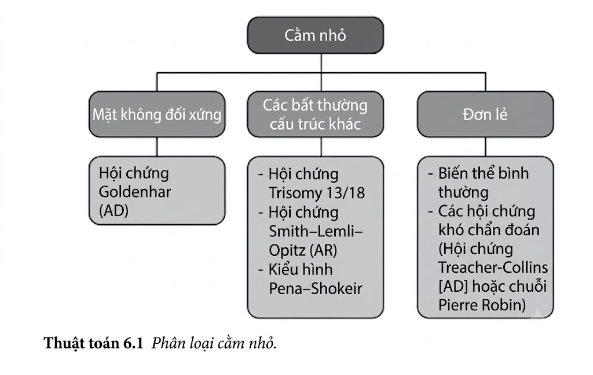
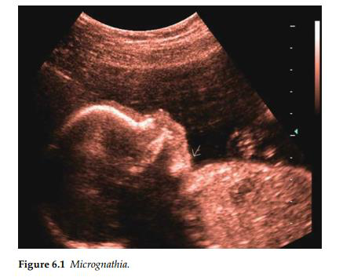

Cằm được quan sát rõ nhất khi trên mặt cắt nghiêng của khuôn mặt. Không có định nghĩa đối với cằm nhỏ, và chẩn đoán là chủ quan. Trừ các trường hợp nghiêm trọng, siêu âm chẩn đoán trước
sinh có thể rất khó khăn.

_Hội chứng Goldenhar_: Còn được gọi là “Hội chứng thiểu sản nửa mặt”, đây là một dị tật
bẩm sinh liên quan đến dẫn xuất từ cung mang thứ nhất và thứ hai. Có sự bất đối xứng giữa
các cấu trúc ở bên trái và bên phải của khuôn mặt. Ngoài các bất thường sọ mặt, có thể có các
khiếm khuyết về tim, đốt sống và hệ thần kinh trung ương. Hầu hết các trường hợp đều xảy ra
ngẫu nhiên, nhưng một số cho thấy sự di truyền trội trên nhiễm sắc thể thường.

_Trisomy 13 (hội chứng Patau)_: Tuổi mẹ có thể đã cao. Độ mờ da gáy có thể tăng lên ở tuần
thứ 11–14. Cell free DNA có thể đã được thực hiện trong quý 1. Các dấu hiệu khác của trisomy
13 có thể xuất hiện, chẳng hạn như giãn não thất, não trước không phân chia, thừa ngón, bàn
chân cong và bất thường tim, ở hơn 95% thai nhi.

_Trisomy 18 (hội chứng Edwards)_: Tuổi của người mẹ có khả năng cao cao. Độ mờ da gáy
có thể tăng lên ở tuần thứ 11–14. Cell free DNA có thể đã được thực hiện trong quý 1. Thai
hạn chế tăng trưởng khởi phát sớm thường xuất hiện và tuổi thai có thể đã được tính lại theo
lần siêu âm sớm. Các dấu hiệu khác của trisomy 18 có thể hiện diện —nang đám rối mạch
mạc, giãn não thất, bàn tay nắm chặt, bệnh tim bẩm sinh (thường phức tạp), thoát vị rốn, dây
rốn một động mạch và bàn chân khoèo.

Hội chứng CHARGE bao gồm sự kết hợp của tịt cửa mũi sau, khuyết cấu trúc mắt, bất
thường về tim, hạn chế tăng trưởng, và khuyết tật phát triển thần kinh.
Phần lớn trong số này, ngoài những bất thường tim, rất khó phát hiện khi siêu âm trước
sinh. Sự bất đối xứng của các cấu trúc đôi khi có thể được nhìn thấy trong hội chứng
CHARGE. Mặc dù sự di truyền được cho là mang tính trội nhiễm sắc thể thường, nhưng
nhiều trường hợp là do đột biến mới ngẫu nhiên.

Hội chứng DiGeorge đôi khi còn được gọi là CATCH22 (bất thường tim/ bất thường mặt,
thiếu hụt tế bào T do giảm sản tuyến ức, hở hàm ếch, hạ canxi máu do suy tuyến cận
giáp) do vi mất đoạn 22q11. Sự rối loạn di cư của các tế bào mào thần kinh cổ vào các dẫn xuất của cung mang và túi
mang có thể giải thích cho kiểu hình này. Hầu hết các trường hợp là ngẫu nhiên và là kết quả
của việc đột biến mất đoạn nhiễm sắc thể 22q11.2. Tuy nhiên, di truyền trội trên nhiễm sắc thể
thường đã được biết đến. Khó khăn trong học tập ở mức độ nhẹ đến trung bình là phổ biến.

Hội chứng Treacher–Collins còn được gọi là chứng rối loạn xương hàm mặt. Các đặc điểm
bao gồm tật khe mi mắt chếch xuống dưới – ra ngoài (antimongoloid slant of the eyes),
tật khuyết bờ mi mắt , cằm nhỏ, hở hàm ếch, tai nhỏ, thiểu sản ngành xương gò má, và
miệng rộng. Ngoài cằm nhỏ, các đặc điểm khác rất khó xác định trên siêu âm trước khi sinh.
Đây là một rối loạn di truyền trội trên nhiễm sắc thể thường với biểu hiện thay đổi.

_Hội chứng Smith–Lemli–Opitz (SLOS)_: Thiếu 7-dehydrocholesterol reductase là yếu tố gây
ra hội chứng SLO. Có bằng chứng về thai hạn chế tăng trưởng trước khi sinh. Bộ phận sinh
dục mơ hồ và sự đảo ngược giới tính ở bào thai nam được nhìn thấy. Đa ngón và đầu nhỏ
thường xuất hiện. Có hiện tượng chậm phát triển tâm thần. Di truyền là lặn nhiễm sắc thể
thường.

**Tài liệu tham khảo**

1. Paladini D. Fetal micrognathia: Almost always an ominous finding. _Ultrasound Obstet Gynecol_. 2010; 35: 377–84.

