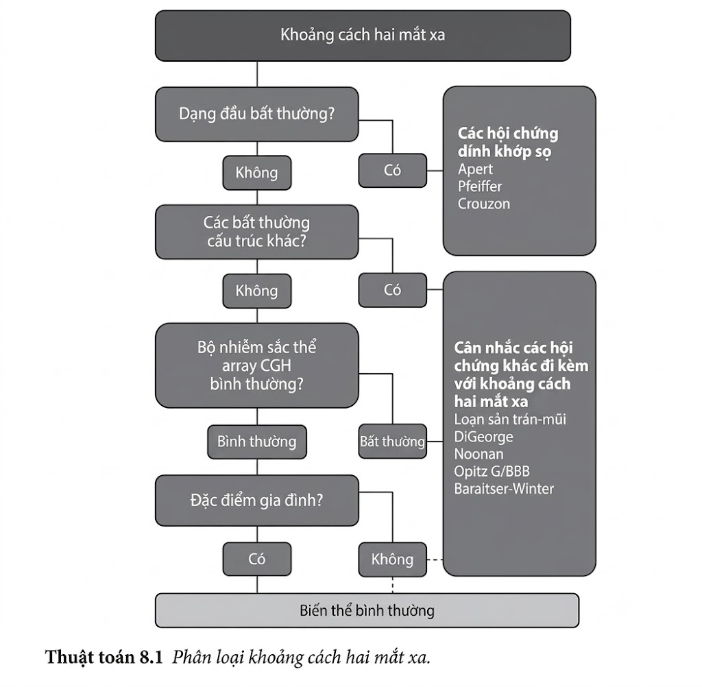
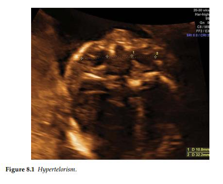

Hypertelorism đề cập đến khoảng cách giữa các mắt trên bách phân vị thứ 95.
Nguyên nhân của chứng hypertelorism bao gồm các nguyên nhân cơ học như sự hợp nhất sớm của
xương sọ hoặc một khe hở vùng mặt. Hội chứng di truyền như loạn sản sọ - trán - mũi, hội chứng
Apert và hội chứng Crouzon có thể có hypertelorism như một phần đặc điểm của chúng.

Chứng hai mắt xa nhau mức độ nhẹ cũng có thể hiện diện như một phát hiện riêng
biệt và không có hậu quả lâm sàng. Khoảng cách trong và ngoài giữa các mắt không được đo thường xuyên khi siêu âm ở tam cá
nguyệt thứ hai. Tuy nhiên, với sự hiện diện của các bất thường khác của bào thai, đặc biệt là khe
hở mặt, hình dạng hộp sọ bất thường, hàm nhỏ và khuyết tật não, việc khảo sát chi tiết về khuôn
mặt có thể góp phần chẩn đoán một tình trạng cơ bản. Phẫu thuật điều chỉnh hypertelorism ngày
nay có sẵn nhưng kết quả chủ yếu được quyết định bởi bệnh lý nền tảng.

**Tài liệu tham khảo**

1. Ondeck CL, Pretorius D, McCaulley J, Kinori M, Maloney T, Hull A, Robbins SL. Ultrasonographic prenatal imaging of fetal ocular and orbital abnormalities. _Surv Ophthalmol_. 2018; 63: 745–753.

