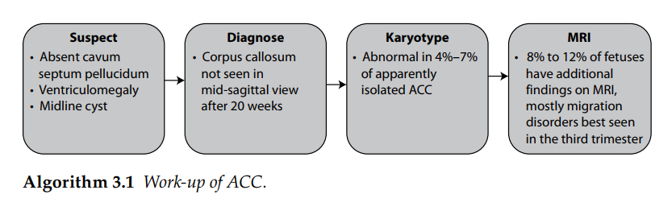
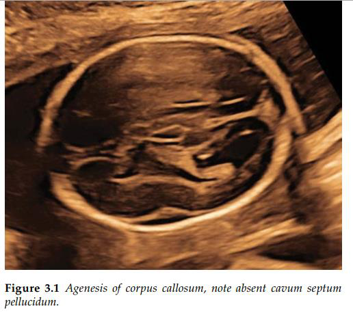
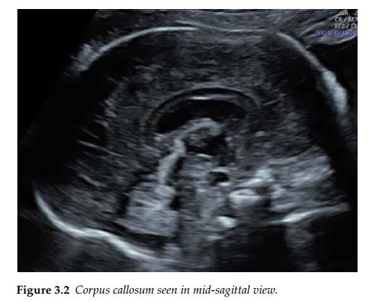

Thể chai là bó sợi lớn nhất nối bán cầu não trái và phải. Sự vắng mặt của nó được gọi là bất sản

của thể chai (ACC) và có thể toàn bộ hoặc một phần (thường thiếu phần sau). Tỉ lệ mắc ACC ước

tính dao động từ 2 trên 10.000 dân số chung, đến 200–600 trên 10.000 trẻ em bị khuyết tật phát

triển thần kinh. Tư vấn trước khi sinh có thể rất khó khăn vì có rất nhiều phổ kết cục lâm sàng từ

bình thường đến chậm phát triển nghiêm trọng về chức năng vận động và nhận thức.

Nghi ngờ ACC

Khảo sát thể chai không phải là một phần thông thường của sàng lọc trong tam cá nguyệt thứ hai.

Tuy nhiên ACC có thể bị nghi ngờ bởi các dấu hiệu gián tiếp như không có vách trong suốt,

giãn não thất và các tổn thương đường giữa bao gồm u mỡ và u nang. Những dấu hiệu gián

tiếp này không nhất quán và không phải lúc nào cũng gặp ở bào thai có ACC một phần.

Chẩn đoán ACC

Việc khảo sát thể chai trên siêu âm đòi hỏi phải có thêm mặt cắt bổ sung ngoài các mặt cắt sàng

lọc tiêu chuẩn. Thể chai có thể được nhìn thấy từ tuần thứ 18 ở các mặt cắt trán và mặt cắt dọc

giữa xuất hiện như một khoảng trống âm mỏng, được giới hạn phía trên và phía dưới bởi các

đường tăng âm. Quan sát động mạch quanh chai ở mặt cắt dọc giữa của não làm nổi bật thể

chai, chạy dọc theo bề mặt trên của thể chai (không có trong ACC).

Khảo sát bổ sung

Karyotype/array CGH (CGH): Tỷ lệ bất thường nhiễm sắc thể ở bào thai có ACC hoàn toàn và

một phần là tăng, ngay cả khi là phát hiện đơn độc.

MRI não thai nhi: Trong trường hợp chẩn đoán trước sinh ACC đơn độc, nguy cơ

Phát hiện bất thường liên quan khi chỉ chụp MRI thai nhi là khoảng 10% ở thai nhi với ACC.

Phần lớn các dị tật bổ sung được phát hiện trên MRI thai nhi liên quan đến khiếm khuyết di trú

thần kinh.

Tư vấn trước sinh ACC đơn độc

Ở khoảng 70% trẻ được chẩn đoán trước sinh là ACC đơn độc, kết cục phát triển thần kinh

bình thường được báo cáo. Chậm phát triển trong chức năng vận động và nhận thức, bệnh

động kinh, các khiếm khuyết về xã hội và ngôn ngữ là những triệu chứng phổ biến nhất được

báo cáo ở những người mắc ACC. Hơn nữa, ACC còn có liên hệ đến sự xuất hiện của bệnh tự kỷ,

tâm thần phân liệt và rối loạn tăng động giảm chú ý. Cha mẹ nên được thông báo rằng chẩn

đoán hình ảnh trước khi sinh không phải lúc nào cũng có thể phân biệt giữa các trường hợp phức

tạp và thể đơn độc, các phát hiện sau sinh được chẩn đoán trong khoảng 5%–10% trường hợp

ACC.

Lược đồ 3.1. Quản lý của ACC

Giải thích lược đồ:

Nếu nghi ngờ :

- Không có vách trong suốt

- Giãn não thất

- Nang đường giữa

 Chẩn đoán: Thể chai không được quan sát thấy ở mặt phẳng dọc giữa sau 20 tuần.

 Làm karyotype: Bình thường trong 4-7% của ACC đơn độc.

 MRI thai nhi: 8-12% thai nhi có thêm những tổn thương trên MRI. Hầu hết các rối loạn

di trú được quan sát tốt nhất ở 3 tháng cuối.

