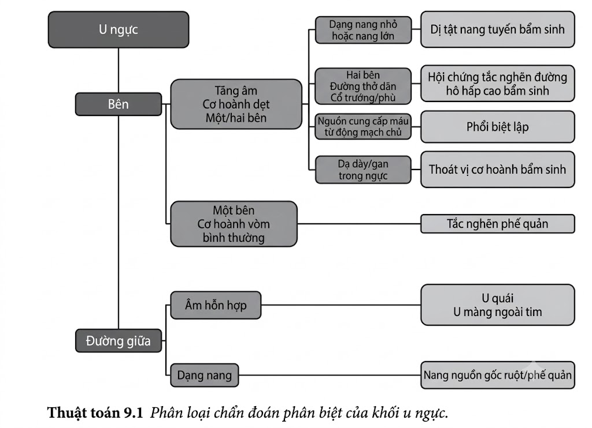
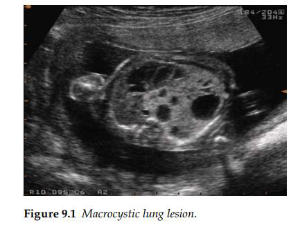
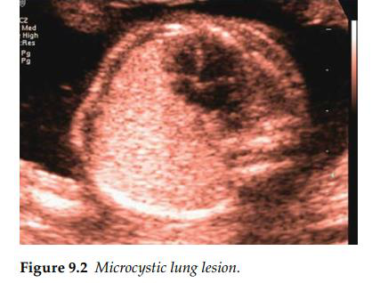
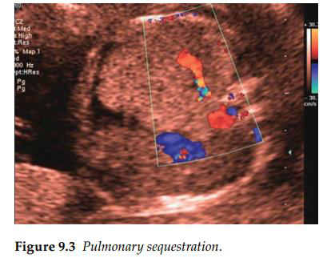

Đa số các khối u ở ngực thai nhi là lành tính và có xu hướng được phát hiện trong quý 2 của thai
kỳ. Khi không có tình trạng phù thai (fetal hydrops) đi kèm, các khối u này có tiên lượng rất tốt.
Trên hình ảnh siêu âm, chúng được nhận diện dưới dạng các tổn thương tăng âm (echogenic
lesions) hoặc tổn thương hỗn hợp (mixed lesions) với các vùng trống âm (anechoic) nằm xen kẽ
bên trong vùng tăng âm.

Đại đa số các tổn thương ở ngực có xu hướng xuất hiện ở một bên (unilateral) và trong nhiều
trường hợp sẽ gây ra tình trạng lệch trục trung thất (shift of the mediastinum) — dấu hiệu này
rất dễ nhận biết do trục tim bị đẩy lệch sang một bên. Tổn thương dạng nang chiếm ưu thế: Thường là dị tật tuyến nang phổi bẩm sinh
(CCAM) thể nang lớn (macrocystic). Đây thường là các tổn thương đơn độc ở thai nhi và
đôi khi có thể cần phải chọc hút dẫn lưu dịch nang để tránh hậu quả chèn ép tim. Tổn thương tăng âm chiếm ưu thế: Cần được tiếp cận với các chẩn đoán phân biệt bao
gồm CCAM (thể nang nhỏ), phổi biệt trí (pulmonary sequestration), hoặc tắc nghẽn phế quản tạm thời (temporary bronchial obstruction).
Sự hiện diện của nguồn cấp máu từ động mạch hệ thống phát sinh từ động mạch
chủ ngực hoặc động mạch chủ bụng đoạn lưng sẽ gợi ý đến chẩn đoán phổi biệt
trí. Khi làm xét nghiệm mô bệnh học sau sinh, hầu hết các tổn thương này được ghi
nhận là thể phối hợp giữa cả CCAM và phổi biệt trí. Khuyến cáo nên theo dõi liên tục các thai kỳ này nhằm loại trừ sự tiến triển của tình trạng phù thai.
Tuy nhiên, phần lớn các trường hợp tắc nghẽn phế quản và CCAM sẽ tự thoái triển (tự nhỏ lại)
một cách tự nhiên, khi tuổi thai càng lớn, các tổn thương này càng trở nên khó nhận diện trên cân
lâm sàng siêu âm. Dù trong bất kỳ trường hợp nào, việc theo dõi sau sinh bằng chụp CT ngực
vẫn được khuyến cáo, vì các phẫu thuật viên có thể cân nhắc cắt bỏ bất kỳ tổn thương tồn dư nào
trong lồng ngực trẻ.

Sự hiện diện của một tổn thương lệch một bên với cấu trúc hỗn hợp âm cần nghi ngờ về tình trạng
thoát vị hoành bẩm sinh (CDH), đặc biệt là khi có kèm theo lệch trục trung thất và không quan
sát thấy bóng dạ dày ở vị trí bình thường trong ổ bụng. Dấu hiệu này cũng phải thúc đẩy một quá trình tìm kiếm kỹ lưỡng các dị tật và dấu hiệu chỉ điểm
khác, do có nguy cơ cao mắc các bất thường nhiễm sắc thể và bất thường cấu trúc đi kèm.
Siêu âm tim thai chi tiết là bắt buộc để loại trừ các bất thường về tim có thể phối hợp. Nhìn
chung, một khối thoát vị hoành đơn độc bên trái có xu hướng có tiên lượng tốt hơn so với thoát vị
hoành bên phải (thường bao gồm Gan). Các dị tật ngoài tim xuất hiện đồng thời sẽ quyết định
một tiên lượng xấu hơn.

Sự hiện diện của các tổn thương ở cả hai bên ngực gợi ý đến tình trạng CCAM hai bên hoặc
hội chứng tắc nghẽn đường hô hấp cao bẩm sinh (CHAOS). Hội chứng này có thể có các đặc
điểm bổ sung như vòm hoành thai nhi bị đảo ngược và các đường dẫn khí bị giãn lớn. Một tỷ lệ
lớn các ca bệnh cũng biểu hiện tình trạng báng bụng (ascites) do dòng máu tĩnh mạch trở về tim
bị cản trở. Bên cạnh việc lên kế hoạch siêu âm chuỗi để đánh giá bất kỳ sự chèn ép tim, những thai nhi này
cần được chỉ định sinh tại các trung tâm y tế tuyến cuối để đánh giá nhu cầu can thiệp phẫu thuật
ngay sau khi chào đời.

Các tổn thương ở đường giữa ngực của thai nhi có thể có nguồn gốc từ ruột, tuyến ức hoặc màng
ngoài tim (pericardial). U đường giữa nguồn gốc ruột hoặc phế quản: Thường có dạng nang và có xu hướng
lành tính. Trừ khi chúng có kích thước quá lớn và chèn ép vào các cấu trúc tim, các khối u
này thường có kết cục lâm sàng tốt. U màng ngoài tim: Thường là u quái (teratomas) và có thể biểu hiện ban đầu dưới dạng
tràn dịch màng ngoài tim. Tùy thuộc vào vị trí chính xác của chúng trên bề mặt màng ngoài
tim, chúng có thể gây ra các rối loạn nhịp tim và các nguy hiểm tiềm tang.
Sự hiện diện của tràn dịch màng ngoài tim cần thúc đẩy việc tìm kiếm kỹ lưỡng các khối u này.
Thêm vào đó, chọc dò tháo dịch màng ngoài tim (pericardiocentesis) cứu sống thai nhi có thể
được chỉ định để thúc đẩy quá trình tăng trưởng và phát triển bình thường của phổi thai nhi.

**Tài liệu tham khảo**

1. Davenport M, Warne SA, Cacciaguerra S, Patel S, Greenough A, Nicolaides K. Current outcome of antenally diagnosed cystic lung disease. _J Pediatr Surg_. 2004; 39(4): 549–56.
2. Gajewska-Knapik K, Impey L. Congenital lung lesions: Prenatal diagnosis and intervention. _Semin Pediatr Surg_. 2015; 24: 156–9.
3. Lim FY, Crombleholme TM, Hedrick HL, Flake AW, Johnson MP, Howell LJ, Adzick NS. Congenital high airway obstruction syndrome: Natural history and management. _J Pediatr Surg_. 2003; 38(6): 940–5.

