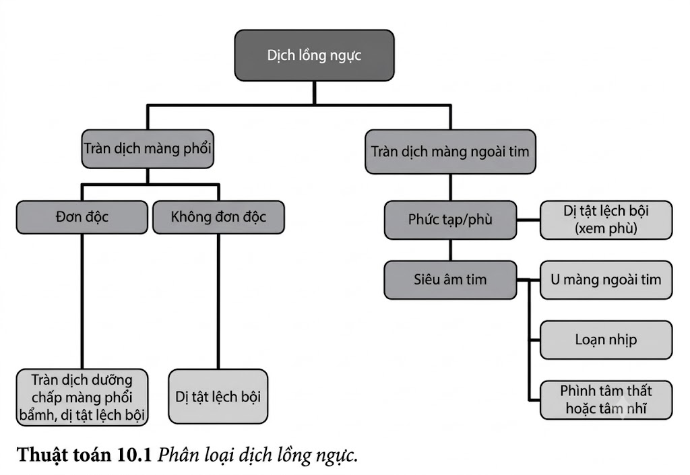
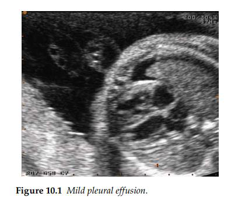
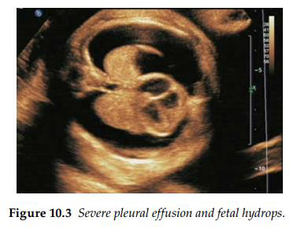
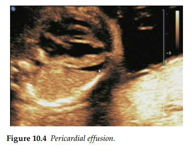

Dịch trong lồng ngực thai nhi được nhìn thấy khá phổ biến trong quá trình siêu âm bình thường
và thỉnh thoảng được phát hiện trong các lần siêu âm đánh giá sự tăng trưởng định kỳ được chỉ
định vì những lý do khác. Dịch có thể được quan sát thấy dưới dạng một cấu trúc tụ dịch dạng
nang, hoặc dưới dạng tràn dịch màng phổi hay tràn dịch màng ngoài tim. Các ổ dịch dạng nang ở
phổi hoặc trung thất cần được tiếp cận và xử trí giống như đối với các khối u ở ngực. Tràn dịch
màng phổi được nhìn thấy dưới dạng vùng tụ dịch bao quanh nhu mô phổi đã bị ép xẹp. Tràn dịch
màng phổi và tràn dịch màng ngoài tim có thể xuất hiện đồng thời trong một số bệnh lý, nhưng
nhìn chung chúng có xu hướng tiến triển độc lập với nhau.

Tràn dịch màng phổi có thể biểu hiện như một phần của tình trạng phù thai toàn thân do nguyên
nhân miễn dịch hoặc không do miễn dịch, đi kèm với một bất thường cấu trúc, hoặc hiếm gặp hơn,
là một tổn thương đơn độc. Hầu hết các trường hợp tràn dịch màng phổi nguyên phát sẽ chuyển
thành dịch dưỡng chấp (chylous) (sau khi trẻ bắt đầu ăn sau sinh); hiện tượng này xảy ra do sự sản
xuất quá mức hoặc do giảm tái hấp thu dịch bạch huyết. Một quá trình tìm kiếm kỹ lưỡng nhằm
nhận diện bất kỳ bất thường cấu trúc nào có thể phối hợp ở thai nhi và ở bánh nhau.
Sự hiện diện của các bất thường về tăng trưởng của thai nhi có thể gợi ý đến một tình trạng
nhiễm virus bẩm sinh tiềm ẩn. Tình trạng phù da (skin edema) có hoặc không kèm theo báng
bụng (ascites) cần thúc đẩy việc khai thác tiền sử và khảo sát trên siêu âm để tìm kiếm các bệnh lý
như: bất đồng nhóm máu (red cell isoimmunization), nhiễm parvovirus, và các dị dạng động

- tĩnh mạch (A-V malformations). U mạch máu màng đệm bánh nhau (placental chorioangioma) đôi khi bị bỏ quên trong những
  tình huống này, nhưng đây lại cấu thành một nguyên nhân quan trọng có thể điều trị được gây ra
  tình trạng tuần hoàn tăng động và suy tim thai.

Ngay cả khi không có bất kỳ dấu hiệu chỉ điểm nhiễm sắc thể nào khác, tràn dịch màng phổi vẫn
mang lại nguy cơ 10% mắc các bất thường nhiễm sắc thể, và do đó một chỉ định chẩn đoán
trước sinh nên được tư vấn cho cặp vợ chồng. Trong nhiều trường hợp, nguyên nhân tiềm ẩn vẫn
không được phát hiện ngay cả sau khi đứa trẻ chào đời. Tuy nhiên, tình trạng tràn dịch vẫn có thể
gây ra một vấn đề nghiêm trọng là cản trở sự phát triển bình thường của phổi (tùy thuộc vào tuổi
thai tại thời điểm xuất hiện) và gây chèn ép tim. Nhiều tác giả khuyến cáo nên thực hiện thủ thuật
đặt ống thông nối màng phổi - buồng ối (thoracoamniotic shunting) nhằm giải phóng áp lực
trong lồng ngực và thúc đẩy phổi phát triển. Việc quản lý tràn dịch màng phổi cần bao gồm một
quy trình khảo sát toàn diện như đối với bất kỳ trường hợp phù thai không do miễn dịch nào.

Việc nhận diện trên siêu âm trước sinh một dải dịch mỏng màng ngoài tim là một dấu hiệu sinh
lý bình thường. Chẩn đoán tràn dịch màng ngoài tim mang tính chất cảm tính (chủ quan), trừ khi
lượng dịch tích lũy là rất lớn. Dấu hiệu này có thể biểu hiện như một tổn thương đơn độc, hoặc là
hệ quả của một khối u màng ngoài tim tiềm ẩn, tình trạng rối loạn nhịp tim thai / bất thường cấu
trúc tim, hay hiếm gặp hơn là đi kèm với túi phình hoặc túi thừa ở tâm thất hoặc tâm nhĩ.
Ý nghĩa lâm sàng của tràn dịch màng ngoài tim đơn độc hiện vẫn chưa được hiểu rõ hoàn toàn. Sự
nghi ngờ về một tình trạng tràn dịch màng ngoài tim là chỉ định bắt buộc phải thực hiện siêu âm
tim thai chi tiết.

**Tài liệu tham khảo**

1. Santolaya-Forgas J. How do we counsel patients carrying a fetus with pleural effusions? _Ultrasound Obstet Gynecol_. 2001; 18(4): 305–8.
2. Slesnick TC, Ayres NA, Altman CA, Bezold LI, Eidem BW, Fraley JK, Kung GC, McMahon CJ, Pignatelli RH, Kovalchin JP. Characteristics and outcomes of fetuses with pericardial effusions. _Am J Cardiol_. 2005; 96(4): 599–601.
3. Yinon Y, Kelly E, Ryan G. Fetal pleural effusions. _Best Pract Res Clin Obstet Gynaecol_. 2008; 22: 77–96.

