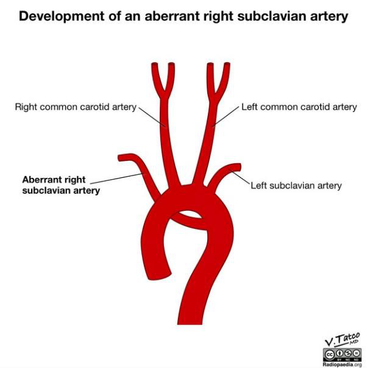

Động mạch dưới đòn phải xuất phát lạc chỗ (ARSA) có thể được chứng minh trên mặt cắt 3

mạch máu và khí quản (3VT view) dưới dạng một mạch máu chạy từ chỗ nối giữa cung động

mạch chủ và ống động mạch, phía sau khí quản, rồi hướng về phía xương đòn và vai bên phải.

Dấu hiệu này được tìm kiếm bằng cách hạ thang vận tốc trên Doppler màu xuống mức 10–15

cm/s.

Trên mặt cắt này, điều quan trọng là không được nhầm lẫn ARSA với tĩnh mạch đơn (azygos

vein) — cấu trúc vốn có đường đi theo hướng của tĩnh mạch chủ trên. Khi nghi ngờ có ARSA,

sự hiện diện của nó có thể được khẳng định chắc chắn bằng cách chứng minh có dòng chảy dạng

động mạch (dòng chảy áp lực cao, có mạch đập) trên phổ Doppler xung (pulsed Doppler).

- Nếu động mạch dưới đòn phải có vị trí xuất phát bình thường, nó sẽ được tìm thấy

ở một mặt cắt của cung động mạch chủ ngang, nằm cao hơn về phía đầu so với mặt

cắt 3 mạch máu và khí quản, và có đường đi nằm ở phía trước so với khí quản.

Ý nghĩa lâm sàng và định hướng quản lý

ARSA xuất hiện với tần suất cao hơn ở những thai nhi mắc hội chứng Down (Trisomy 21) và

những thai nhi có các rối loạn nhiễm sắc thể khác, bao gồm cả đột biến vi mất đoạn 22q11. Do

đó, việc phát hiện thấy ARSA trong quá trình siêu âm thai trước sinh cần phải thúc đẩy siêu âm

hình thái học chi tiết bởi một chuyên gia y học bào thai, chuyển tuyến để siêu âm tim thai chuyên

sâu, và thực hiện chẩn đoán trước sinh để sàng lọc tình trạng lệch bội. Đôi khi, ARSA có thể gây

ra áp lực lên thực quản và có khả năng dẫn đến triệu chứng nuốt khó sau này.
