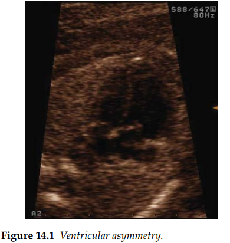
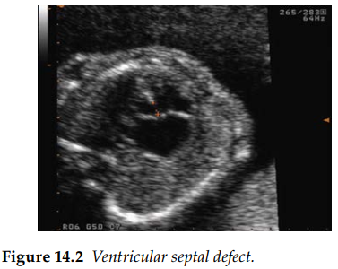
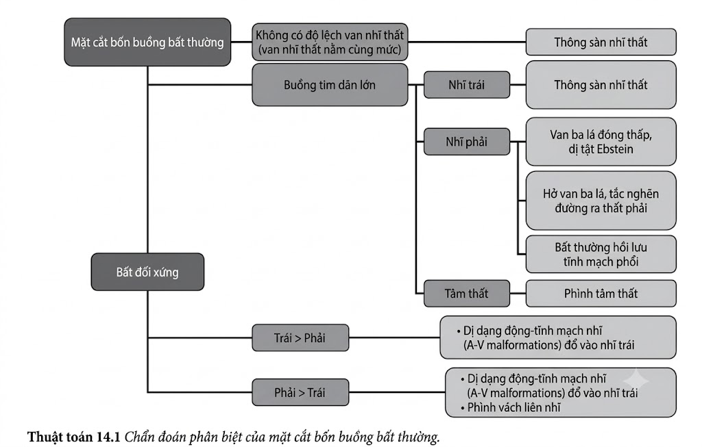
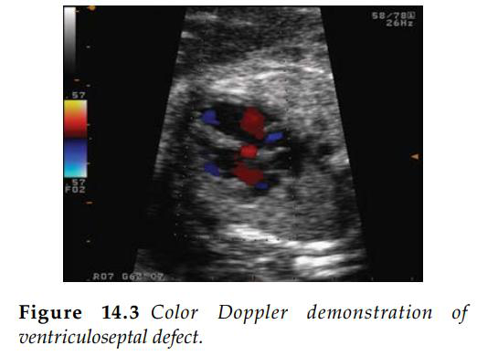
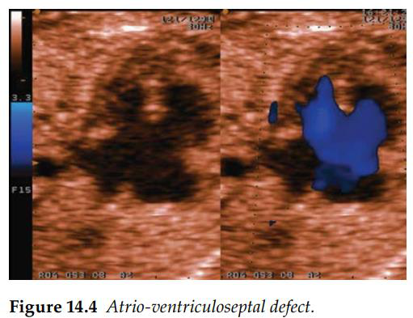

Trong sàng lọc thường quy tim thai, lý tưởng nhất là nên mở rộng các mặt cắt để kiểm tra đường
ra và sử dụng Doppler màu để đánh giá toàn diện tim thai. Tuy nhiên, do giới hạn thời gian của
một ca siêu âm thường quy, chương này chỉ giới hạn trong việc đánh giá mặt cắt bốn buồng.

Dưới đây là bảng kiểm (checklist) khi siêu âm tim thai:

1.  Kiểm tra định vị tạng ổ bụng (abdominal situs): Đây là bước bắt buộc để xác định bên trái và bên phải của thai nhi, đảm bảo tim và dạ dày thai nhi nằm ở bên trái.
2.  Mỏm tim thai hướng về bên trái và phần lớn tim nằm ở lồng ngực trái.
3.  Tim chiếm 1/3 diện tích lồng ngực.
4.  Gồm bốn buồng tim với các tâm thất và tâm nhĩ đối xứng nhau.
5.  Nhận diện được dải điều hòa, đây là dấu hiệu đặc trưng giúp xác định tâm thất phải.
6.  Quan sát thấy hai van nhĩ-thất đóng mở; vị trí bám của các van này vào vách liên thất có sự chênh lệch, trong đó van ba lá bám về phía mỏm tim hơn so với van hai lá.
7.  Vách liên thất nguyên vẹn (tốt nhất nên kiểm tra khi vách liên thất nằm theo phương ngang).

Các khảo sát chuyên sâu hơn cần kiểm tra các đường ra và đảm bảo có sự bắt chéo. Phần lớn các
cấu trúc này có thể được đánh giá trên mặt cắt ba mạch máu. Bất kỳ sự thay đổi đáng ngờ nào đối
với các đặc điểm trên đều cần chỉ định chuyển tuyến để làm siêu âm tim thai chi tiết.

Các bất thường về định vị tạng (situs) và lệch trục tim được thảo luận trong Chương 13.

Tim to (cardiomegaly) là một chỉ định để làm siêu âm tim thai chi tiết và đánh giá
toàn diện huyết động học của thai nhi. Tình trạng này thường là thứ phát sau một bệnh lý khác của thai, bao gồm thai chậm tăng
trưởng trong tử cung, các trạng thái tuần hoàn tăng động như thiếu máu (do nhiễm parvovirus, bất đồng nhóm máu), dị dạng động-tĩnh mạch ở thai nhi (A-V malformations), u mạch máu màng
đệm bánh nhau (placental chorioangioma), và đôi khi do loạn nhịp tim thai chậm hoặc nhanh. Các nguyên nhân nguyên phát bao gồm những bất thường cấu trúc tim lớn và sẽ cần đánh
giá chi tiết – điều này nằm ngoài phạm vi của chương này. Rõ ràng, việc nghi ngờ tim to đòi hỏi phải thực hiện siêu âm tim thai chuyên sâu.

Sự bất đối xứng của các buồng tim thường phản ánh một vấn đề cấu trúc tại
các van nhĩ-thất (A-V) hoặc đường ra đại động mạch. Các nguyên nhân hiếm gặp bao
gồm bất thường hồi lưu tĩnh mạch phổi, khi một hoặc nhiều tĩnh mạch đổ về bên
phải của tim thay vì bên trái.

Sự mất dấu so le bình thường giữa các van nhĩ-thất gợi ý sự hiện diện của khuyết tật
kênh nhĩ thất – hay còn gọi là kênh nhĩ thất (A-V septal defect - AVSD) – và dị tật này có liên quan đến
50%–60% nguy cơ mắc các bất thường nhiễm sắc thể tiềm ẩn. Điều này đòi hỏi phải
tìm kiếm kỹ lưỡng các dấu hiệu (markers) khác của bất thường nhiễm sắc thể. Một tỷ
lệ đáng kể các trường hợp này cũng sẽ có bất thường về định vị tạng (xem Chương 13).

**Tài liệu tham khảo**

1. Bolnick AD, Zelop CM, Milewski B et al. Use of the mitral valve-tricuspid valve distance as a marker of fetal endocardial cushion defects. _Am J Obstet Gynecol_. 2004; 191(4): 1483–5.
2. Del Bianco A, Russo S, Lacerenza N et al. Four chamber view plus three-vessel and trachea view for a complete evaluation of the fetal heart during the second trimester. _J Perinat Med_. 2006; 34(4): 309–12.

