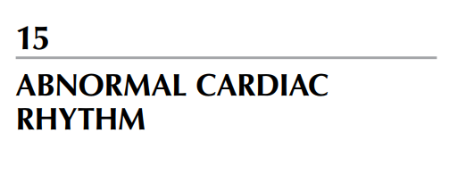
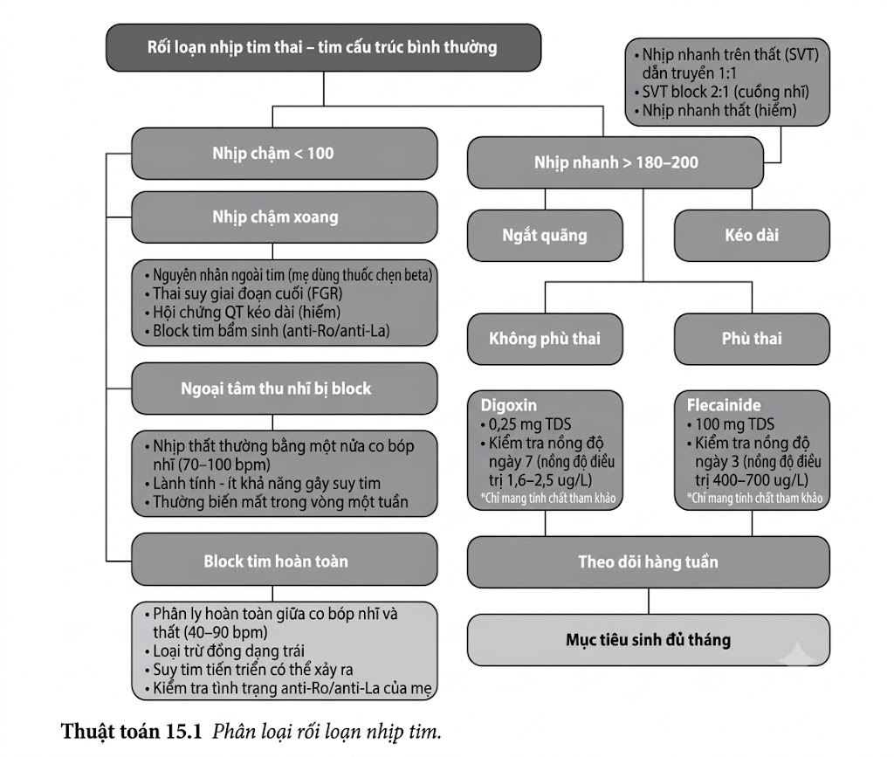
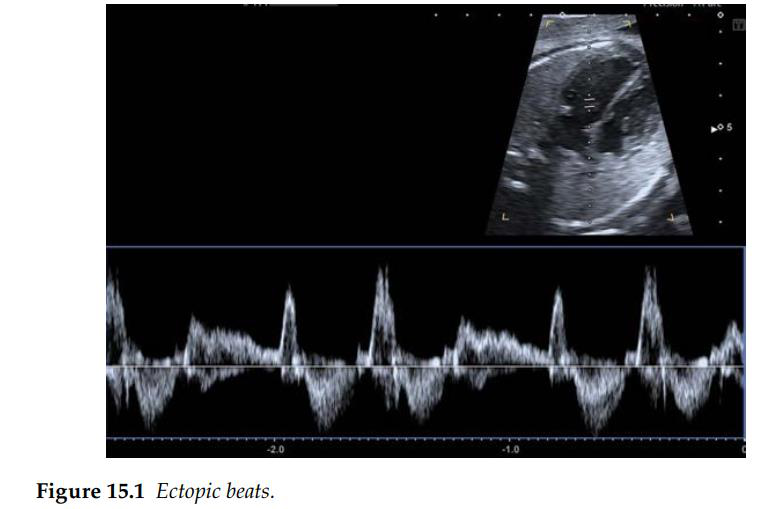

Nhịp tim thai bình thường dao động trong khoảng từ 110 đến 160 chu kỳ/phút. Các giai đoạn nhịp
chậm hoặc nhịp nhanh thoáng qua rất phổ biến và không có ý nghĩa lâm sàng. Khi chẩn đoán loạn
nhịp tim thai, trước hết cần phải loại trừ các nguyên nhân ngoài tim gây nhịp nhanh, chẳng hạn
như thuốc của mẹ (salbutamol, terbutaline), sốt ở mẹ, và cường giáp.

**Bất thường cấu trúc tim thai**

Sau khi đã loại trừ các nguyên nhân ngoài tim gây loạn nhịp thai nhi, cần phải kiểm tra cẩn
thận tim thai để loại trừ các bất thường về cấu trúc. Loạn nhịp tim thai có thể là một phần của các bệnh lý tim cấu trúc phức tạp; trong những
trường hợp này, tiên lượng chủ yếu sẽ do bệnh lý nền quyết định.

**Tổn thương chức năng tim thai**

Loạn nhịp tim thai cũng có thể biểu hiện đi kèm với một mức độ suy tim nhất định. Do đó,
việc ghi nhận sự hiện diện hoặc vắng mặt của tình trạng tim to, hở van nhĩ - thất, tràn dịch
màng tim, và phù thai (hydrops) là rất quan trọng.

**Ngoại tâm thu**

Ngoại tâm thu là dạng loạn nhịp tim thai phổ biến nhất và thường xuất hiện trong tam cá nguyệt
thứ ba. Ngoại tâm thu bản chất là do một nhịp phụ khởi phát sớm và nằm ngoài nút tạo nhịp tự
nhiên. Chúng không có ý nghĩa lâm sàng, không phải là dấu hiệu của suy thai, và không cần
bất kỳ hình thức điều trị nào. Nhịp không đều do ngoại tâm thu có xu hướng tự giải quyết khi gần đến ngày sinh và không
cần theo dõi đặc hiệu sau sinh. Trong một số ít trường hợp ngoại tâm thu nhịp đôi (bigeminy)
hoặc ngoại tâm thu xuất hiện với tần suất rất dày, thai nhi sẽ có nguy cơ tiến triển thành loạn
nhịp nhanh kéo dài; do đó, khuyến cáo nên theo dõi nhịp tim thai hàng tuần.

**Nhịp nhanh thai nhi**

Nhịp nhanh thai nhi (ví dụ: tim nhanh trên thất - SVT với dẫn truyền nhĩ thất 1:1, và cuồng
nhĩ) có thể được điều trị trong tử cung bằng digoxin, sotalol, hoặc flecainide, tùy thuộc vào
loại loạn nhịp, sự hiện diện của phù thai, tuổi thai, và lựa chọn của bác sĩ lâm sàng. Do nguy
cơ gây loạn nhịp cho người mẹ, cần chỉ định làm điện tâm đồ (ECG) cho mẹ trước và trong
quá trình điều trị.

**Nhịp chậm thai nhi**

Nhịp chậm thai nhi thứ phát do block tim hoàn toàn (block nhĩ thất cấp 3) không có phương
pháp điều trị đặc hiệu trong tử cung, nhưng việc theo dõi sát sao để tối ưu hóa thời điểm sinh
và đánh giá sau sinh để đặt máy tạo nhịp có thể mang lại ảnh hưởng lớn đến kết cục lâm sàng.
Cần thực hiện điện tâm đồ 12 chuyển đạo cho bố mẹ và xét nghiệm kháng thể tự miễn của
mẹ (anti-Ro và anti-La).

**Tài liệu tham khảo**

1. Bravo-Valenzuela NJ, Rocha LA, Machado Nardozza LM et al. Fetal cardiac arrhythmias: Current evidence. _Ann Pediatr Cardiol_. 2018; 11: 148–63.
2. Carvalho JS, Fetal dysrhythmias. _Best Pract Res Clin Obstet Gynaecol_. https://doi.org/10.1016/j.bpobgyn.2019.01.002.

