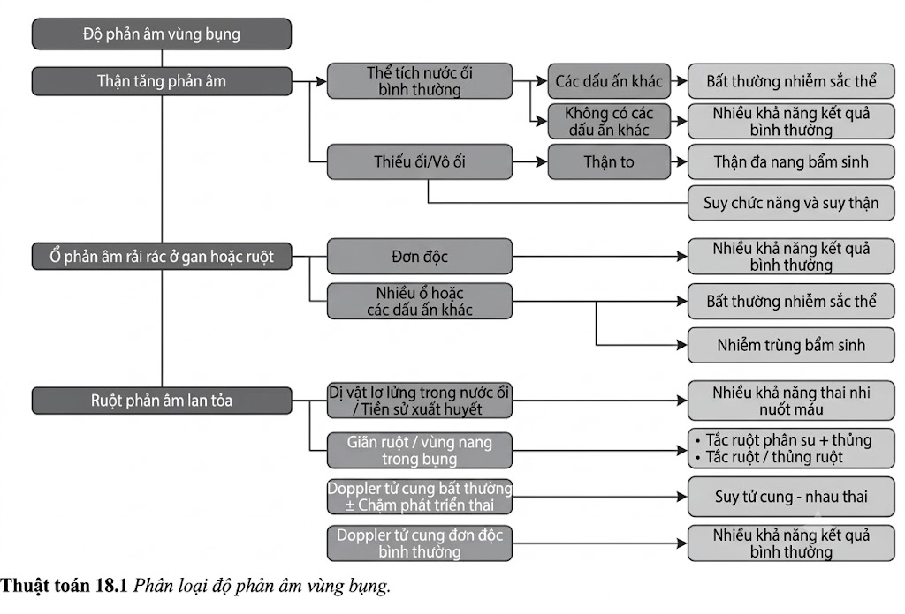
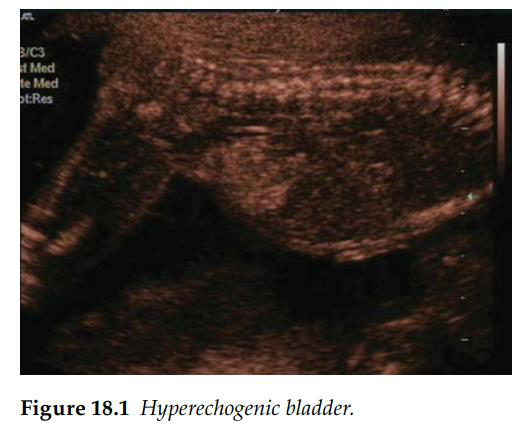
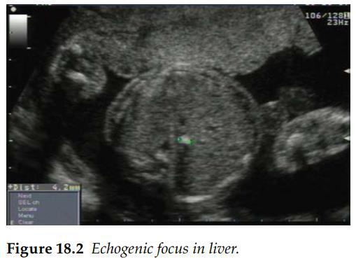
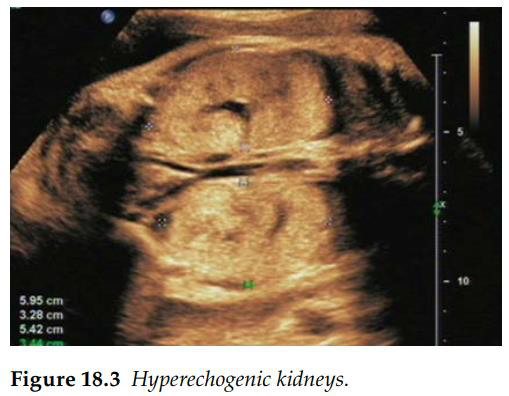

Phát hiện vùng tăng hồi âm trong ổ bụng thai nhi là một tình trạng thường gặp. Tổn thương này có
thể xuất hiện ở các quai ruột, thận hoặc gan của thai nhi.

_Ruột tăng âm_ là khối tăng hồi âm phổ biến nhất trong ổ bụng thai nhi. Theo định nghĩa,
ruột chỉ được coi là tăng âm khi độ sáng của nó tương đương hoặc sáng hơn phần
xương lân cận, cụ thể là mào chậu. Nguyên nhân phổ biến nhất là thai nhi nuốt phải các tế bào máu. Tình trạng này thường
được nhận diện qua hình ảnh các hạt lơ lửng trong nước ối và được củng cố bằng tiền
sử xuất huyết âm đạo của người mẹ. Mối liên hệ di truyền là nếu không đi kèm với bất kỳ chỉ điểm bất thường nhiễm sắc
thể hoặc dị tật cấu trúc nào khác, phát hiện đơn độc này ít có khả năng làm tăng nguy
cơ bất thường nhiễm sắc thể ở nhóm sản phụ đã qua sàng lọc trước đó.
Dù vậy, các lựa chọn sàng lọc chuyên sâu hơn như xét nghiệm tiền sản không xâm
lấn (NIPT) hoặc xét nghiệm chẩn đoán xâm lấn (chọc ối) vẫn có thể được đề xuất cho
bệnh nhân. Sự hiện diện của tình trạng giãn ruột phối hợp kèm theo có hoặc không
có dịch cổ trướng cần nghĩ đến khả năng xảy ra viêm phúc mạc phân su (meconium
peritonitis). Biến chứng này xuất hiện khi có tình trạng thủng ruột trong tử cung, gây
ra viêm phúc mạc hóa học. Nguyên nhân có thể do tắc ruột phân su, và cặp vợ chồng
nên được đề xuất sàng lọc bệnh xơ nang (cystic fibrosis). Các nguyên nhân khác bao
gồm teo ruột hoặc xoắn ruột; các bệnh lý này sẽ đi kèm với tình trạng giãn các quai
ruột và có thể biểu hiện muộn hơn trong thai kỳ.

_Nốt tăng âm đơn độc/Rời rạc (Discrete isolated/single echogenic foci in the fetal adbomen)_ là một phát hiện tương đối phổ
biến khi siêu âm hình thái học thường quy. Cần phải tìm kiếm kỹ lưỡng không chỉ các
nốt tăng âm tương tự ở não, lồng ngực... mà còn cả các chỉ điểm bất thường nhiễm sắc
thể hoặc dấu hiệu nhiễm trùng ở thai nhi. Điển hình là các nhiễm trùng bẩm sinh như thủy đậu (varicella)
thường biểu hiện với nhiều nốt tăng âm ở gan kèm theo các dấu hiệu khác như thai
chậm tăng trưởng, giãn não thất ... Có thể cân nhắc sàng lọc bằng chứng nhiễm trùng
ở mẹ để trấn an gia đình. Nếu kết quả sàng lọc nhiễm trùng âm tính, một ca siêu âm theo dõi
tăng trưởng tiếp theo sẽ giúp xác định các phát triển mới, như sự tăng kích thước của
các nốt tăng âm; nếu đi kèm tăng sinh mạch máu rõ rệt sẽ gợi ý một dị dạng mạch máu.
Loại thay đổi này cực kỳ hiếm gặp và chỉ được báo cáo rải rác dưới dạng dị dạng u
máu (hemangiomatous malformations) ở gan, lách hoặc hiếm hơn là ở tuyến thượng
thận của thai nhi. Thông thường, các nốt này chỉ là những phát hiện đơn độc, không đi kèm
bất thường nào khác và không ảnh hưởng đến kết cục của thai nhi.

_Thận tăng âm (Echogenic kidneys)_ đi kèm với tình trạng giãn đường ra của hệ tiết niệu gợi ý chức năng thận
kém. Nếu không có tình trạng tắc nghẽn đường bài xuất rõ
rệt, cần đánh giá thể tích nước ối. Nếu thể tích nước ối hoàn toàn bình thường, đây có
thể chỉ là một biến thể sinh lý với kết cục thai kỳ bình thường.
Sự hiện diện của tình trạng thiểu ối hoặc vô ối đi kèm với
thận tăng âm gợi ý tình trạng rối loạn chức năng thận và thường có tiên lượng xấu.
Bệnh thận đa nang thể sơ sinh (Infantile polycystic kidneys): Bệnh lý này thường
biểu hiện dưới dạng thận to, tăng âm mạnh và mất phân biệt tủy - vỏ thận. Tổn thương
này luôn đi kèm với tình trạng vô ối và là một dị tật bẩm sinh gây tử vong.

**Tài liệu tham khảo**

1. McNamara A, Levine D. Intra-abdominal fetal echogenic masses: A practical guide to diagnosis and management. _Radiographics_. 2005; 25(3): 633–45.
2. Sepulveda W, Leung KY, Robertson ME et al. Prevalence of cystic fibrosis mutations in pregnancies with fetal echogenic bowel. _Obstet Gynecol_. 1996; 87(1): 103–6.
3. Simchen MJ, Toi A, Bona M et al. Fetal hepatic calcifications: Prenatal diagnosis and outcome. _Am J Obstet Gynecol_. 2002; 187(6): 1617–22.

