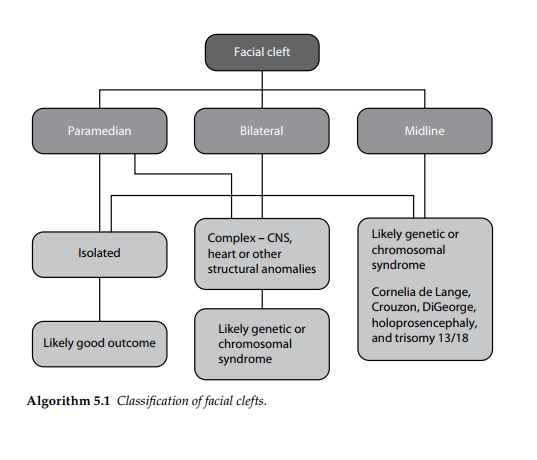
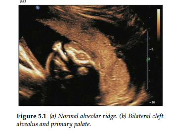
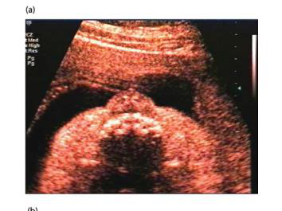
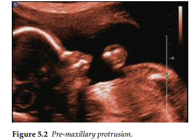
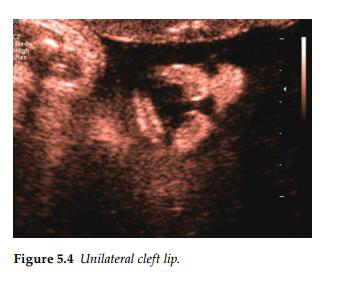
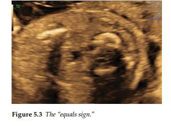

Khe hở mặt thường đơn độc nhưng có thể liên quan đến các tình trạng y khoa khác như bất thường

về nhiễm sắc thể, hội chứng di truyền và tiền sử gia đình bị khe hở mặt. Sứt môi có liên quan đến

hở hàm ếch trong phần lớn các trường hợp.

        Nhận diện trên siêu âm bao gồm việc có được hình ảnh mặt cắt vành của khuôn mặt đưa ra

môi và lỗ mũi. Khiếm khuyết ở cung xương ổ răng có thể được chứng minh trên một mặt cắt

ngang. Mặt cắt nghiêng sẽ hiển thị “phần nhô ra của xương tiền hàm ” trong trường hợp sứt môi/

ổ răng hai bên. Vòm miệng ( hàm ếch ) thường khó quan sát trực tiếp trên siêu âm; tuy nhiên,

khiếm khuyết của cung xương ổ răng có thể được chứng minh, và trong hầu hết các trường hợp,

có liên quan đến khiếm khuyết của khẩu cái cứng.

      Chẩn đoán trước sinh bệnh hở hàm ếch không có sứt môi/ cung ổ răng là cực kỳ khó khăn.

Việc sử dụng “ mặt cắt ngược ” trên siêu âm 3-D đã được mô tả để cải thiện việc xác định trước

khi sinh các khuyết tật của vòm miệng. “Dấu hiệu dấu bằng” ( quals sign ) ( một cấu trúc hồi

âm điển hình của lưỡi gà bình thường ) có thể giúp đánh giá khẩu cái mềm trong trường hợp sứt

môi và vòm miệng.

- Hình ảnh của dấu bằng chứng tỏ vòm miệng còn nguyên vẹn.

- Sự vắng mặt của dấu bằng cho thấy hở hàm ếch và cần kiểm tra thêm khẩu cái

mềm ở mặt cắt dọc giữa.

Khe hở vòm miệng có thể được xác nhận khi khẩu cái mềm không thể nhìn thấy được.

Kiểm tra cẩn thận cấu trúc tim và não của thai nhi được chỉ định. Ngưỡng chuyển tuyến siêu âm

tim thai nên được đặt ở mức thấp.

Khe hở môi/ cung răng ở giữa và thể hai bên có liên quan đến tỷ lệ cao hơn nguy cơ bất thường

về nhiễm sắc thể hoặc cấu trúc đường giữa của não. Xác định sự liên quan trước khi sinh các hội

chứng di truyền cũng rất khó khăn nếu không có tiền sử gia đình. Khe hở mặt là một đặc điểm

được công nhận của trisomy 13.

Trisomy 13 (hội chứng Patau): Tuổi mẹ có thể đã cao. Các độ mờ da gáy có thể tăng lên ở tuần

thứ 11–14. Cell free DNA có thể đã được thực hiện trong ba tháng đầu tiên. Các chỉ số khác của

trisomy 13 có thê hiện diện; có thể có những bất thường về thần kinh trung ương như giãn não thất

hoặc não trước không phân chia. Những bất thường về tim xuất hiện ở trên 95% thai nhi. Có thể

thấy tật đa

ngón và bàn chân hình ghế bập bênh ( rocker bottom feet ).

Giải thích lược đồ:

KHE HỞ MẶT

- Khe hở mặt cạnh trung tâm  đơn độc  Khả năng tiên lượng tốt.

- Phức tạp: Kèm bất thường hệ tktw, bất thường tim hay cấu trúc khác  Khả năng

hội chứng di truyền or NST.

- Khe hở mặt 2 bên:

- Nếu đơn độc  tiên lượng tốt .

- Phức tạp: Kèm theo bất thường hệ tktw, bất thường tim hay cấu trúc khác  Khả

năng hội chứng di truyền or NST.

- Khả năng hc di truyền or NST:

- Cornelia de Lange,

- Crouzon, DiGeorge,

- Holoprosencephaly, and trisomy 13/18.

- Khe hở mặt đường giữa  Khả năng hc di truyền or NST:

- Cornelia de Lange,

- Crouzon, DiGeorge,

- Holoprosencephaly, and trisomy 13/18

Hình 5.1: Ổ răng bình thường. B. Hở ổ răng 2 bên và hàm ếch đầu tiên
