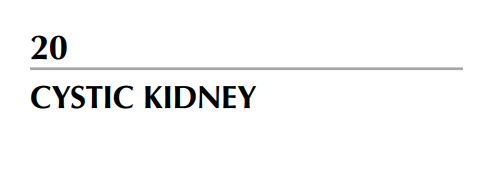
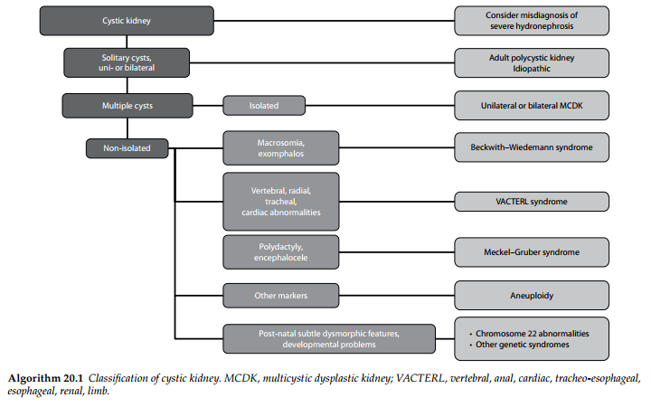
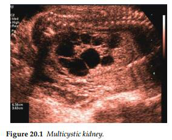
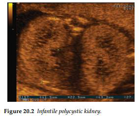
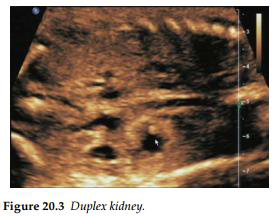

Nang thận là một phát hiện thường gặp trong quá trình sàng lọc trước sinh định kỳ.

- Sự hiện diện của các nang ở vùng vỏ thận cùng với tình trạng tăng âm của thận gợi ý đến chẩn

đoán bệnh thận đa nang di truyền theo nhiễm sắc thể trội ở người trưởng thành (ADPKD). Ở

một số thai nhi, người ta cũng có thể quan sát thấy các nang ở gan và lách. Trong tình trạng

này, bàng quang và thể tích nước ối thường ở mức bình thường.

- Tình trạng đa nang kèm theo thận loạn sản có thể xảy ra ở một hoặc cả hai bên thận. Trong

bệnh lý này, ranh giới giữa vùng vỏ và vùng tủy thận không còn rõ ràng; các nang phân bố một

cách ngẫu nhiên và thường làm biến dạng đường bờ (hình dáng ngoài) của thận. Nhìn chung,

thận loạn sản đa nang một bên thường là một tổn thương đơn độc và có tiên lượng rất tốt,

với điều kiện là quả thận bên đối diện hoàn toàn bình thường.

- Thận loạn sản đa nang hai bên thường đi kèm với tình trạng vô ối hoặc thiểu ối nặng; điều

này có thể làm cản trở việc đánh giá các cấu trúc giải phẫu còn lại của thai nhi do khả năng

quan sát kém.

Việc phát hiện tình trạng thai nhi to đi kèm với thoát vị rốn nhỏ sẽ gợi ý đến hội chứng

Beckwith-Wiedemann, tuy nhiên hội chứng này thường đi kèm với lượng nước ối bình thường

hoặc tăng (đa ối).

Các dị tật đa cơ quan như bất thường ở đốt sống và tim sẽ gợi ý đến chẩn đoán hội chứng liên

kết VATER/VACTERL hoặc các bất thường về nhiễm sắc thể như trisomy 13 (hội chứng

Patau) hoặc trisomy 18 (hội chứng Edwards).

Sự hiện diện của dị tật thừa ngón (polydactyly) cùng với thoát vị não (encephalocele) sẽ gợi

ý mạnh mẽ đến khả năng mắc hội chứng Meckel-Gruber (di truyền theo nhiễm sắc thể lặn).

Nhiều hội chứng di truyền chỉ được chẩn đoán chính xác sau khi tiến hành đánh giá trẻ sơ sinh

sau sinh hoặc thông qua khám nghiệm tử thi. Thận loạn sản đa nang 2 bên (MCKD) là một

bệnh lý gây tử vong, nguyên nhân vừa do sự thiếu hụt chức năng thận bình thường, vừa do tình

trạng thiểu sản phổi.

- Sự vắng mặt của các dị tật đi kèm, kết quả xét nghiệm nhiễm sắc thể bình thường và

lượng nước ối đầy đủ đều là những dấu hiệu đáng tin cậy giúp an tâm trong các trường

hợp mắc MCKD một bên. Cần phải thăm khoán tất cả trẻ sơ sinh bị ảnh hưởng bởi

tình trạng này.

DỊCH BẢNG:

- Nang thận  Xem xét chẩn đoán nhầm với Thận ứ nước mức độ nặng.

NANG THẬN

- Nhiều Nang đơn độc, một hoặc hai bên  Bệnh thận đa nang ở người trưởng thành hoặc Vô

căn.

- Nhiều nang:

1. Đơn độc  Thận loạn sản đa nang một bên hoặc hai bên.

2. Không đơn độc:

- Thai nhi to, thoát vị rốn  Hội chứng Beckwith–Wiedemann.

- Dị tật đốt sống, xương quay, khí quản, tim  Hội chứng VACTERL.

- Thừa ngón, thoát vị não  Hội chứng Meckel–Gruber.

- Các dấu hiệu chỉ điểm khác  Lệch bội nhiễm sắc thể.

- Các đặc điểm kiểu hình bất thường kín đáo sau sinh, các vấn đề về phát triển:

o Bất thường nhiễm sắc thể 22

o Các hội chứng di truyền khác.

- MCDK: Thận loạn sản đa nang (multicystic dysplastic kidney).

- VACTERL: Viết tắt của Đốt sống (vertebral), Hậu môn (anal), Tim (cardiac), Khí - thực quản

(tracheo-esophageal), Thực quản (esophageal), Thận (renal), Chi (limb).

- Thận đôi

