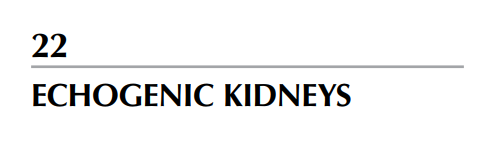
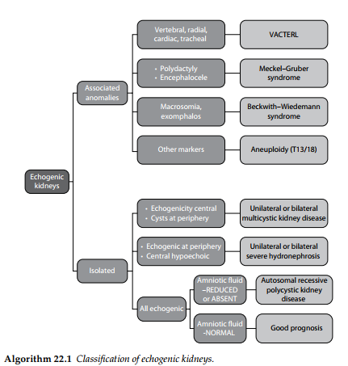
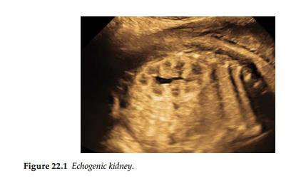
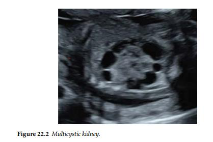
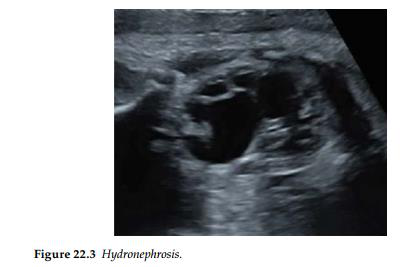

Thận được coi là tăng âm khi chúng có cấu trúc sáng trắng hơn so với mô gan hoặc mô lách

nằm kế cận.

 Mức độ tăng âm dường như không có sự tương quan với kết cục của thai nhi, và thách thức

lớn nhất đối với các bác sĩ là phải xác định xem tình trạng thận tăng âm này chỉ là một biến

thể bình thường hay là dấu hiệu chỉ điểm của một bệnh lý thận nghiêm trọng. Tiền sử gia

đình có người mắc bệnh lý về thận là một yếu tố rất phổ biến trong bệnh thận đa nang di

truyền theo nhiễm sắc thể trội ở người trưởng thành (ADPKD); mặc dù bệnh lý này điển

hình chỉ khởi phát ở giai đoạn trưởng thành, nhưng các trường hợp biểu hiện sớm với

những phát hiện ngay từ giai đoạn trước sinh cũng đã được ghi nhận.

- Trường hợp không đơn độc (Có kèm dị tật khác)

Khi tình trạng thận tăng âm xuất hiện đồng thời với nhiều dị tật bẩm sinh khác, một bất

thường nhiễm sắc thể hoặc các hội chứng di truyền tiềm ẩn nên được xem xét. Các ví dụ

điển hình bao gồm hội chứng Meckel-Gruber, hội chứng VACTERL và trisomy 13 (hội

chứng Patau).

- Thể tích nước ối bất thường

Sự xuất hiện của tình trạng thiểu ối hoặc vô ối — bất kể do nguyên nhân gì — đều là dấu

hiệu cho thấy tiên lượng rất tồi tệ.

 Nếu thận lớn, tăng sáng đi kèm với tình trạng thiểu ối, chẩn đoán bệnh thận đa

nang di truyền theo nhiễm sắc thể lặn (ARPKD) nên được xem xét. Tỷ lệ lưu hành

của bệnh này là 1:30.000 và nguy cơ tái phát là 25%. Chẩn đoán trước sinh đối với

bệnh lý này hiện đã khả thi, tuy nhiên việc tiến hành xét nghiệm di truyền trên ca

bệnh chỉ điểm (ca đầu tiên trong gia đình) là yếu tố mang tính nền tảng. Việc chẩn

đoán qua hình ảnh siêu âm đôi khi không thể thực hiện được trước giai đoạn muộn

của tam cá nguyệt thứ hai hoặc tam cá nguyệt thứ ba.

o Nếu thận giãn lớn cùng với các chỉ số đo đạc khác của cơ thể thai nhi đều tăng,

nhưng lượng nước ối vẫn duy trì ở mức bình thường, bác sĩ cần phải cân nhắc đến

các hội chứng phát triển quá mức như hội chứng Beckwith–Wiedemann và hội

chứng Perlman.

- Các biến thể bình thường

Tình trạng tăng độ hồi âm của thận nhưng đi kèm với thể tích nước ối bình thường và kích

thước hai quả thận hoàn toàn bình thường thì nhiều khả năng là một biến thể bình thường

của thai nhi.

Dịch bảng:

NHÁNH 1 (BÊN TRÊN): Có dị tật đi kèm

THẬN TĂNG ÂM

- Dị tật đốt sống, xương quay, tim, khí quản  Hội chứng liên kết VACTERL.

- Thừa ngón, thoát vị não  Hội chứng Meckel–Gruber.

- Thai nhi to, thoát vị rốn  Hội chứng Beckwith–Wiedemann.

- Các dấu hiệu chỉ điểm khác  Lệch bội nhiễm sắc thể (Trisomy 13 /Trisomy 18).

NHÁNH 2 (BÊN DƯỚI): Đơn độc (Isolated)

- Tăng âm ở trung tâm và có các nang ở vùng ngoại vi  Thận loạn sản đa nang một bên hoặc

hai bên.

- Tăng âm ở ngoại vi và giảm âm ở trung tâm  Thận ứ nước mức độ nặng một bên hoặc hai

bên.

- Toàn bộ quả thận đều tăng âm

- Nước ối GIẢM hoặc VÔ ỐI  Bệnh thận đa nang di truyền gen lặn.

- Nước ối BÌNH THƯỜNG  Tiên lượng tốt.

-

