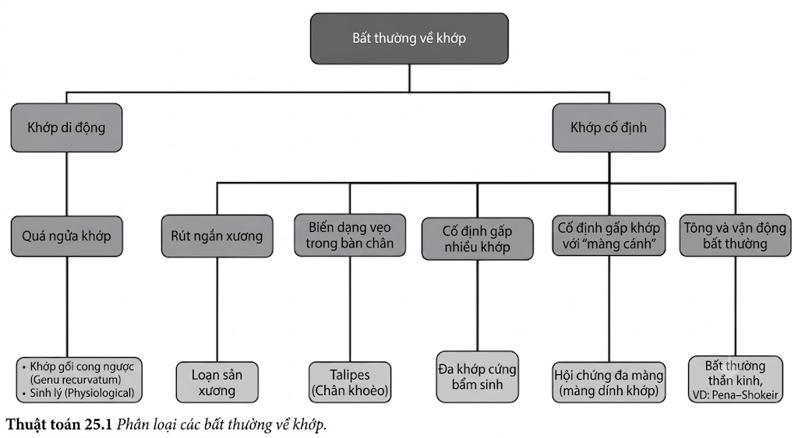
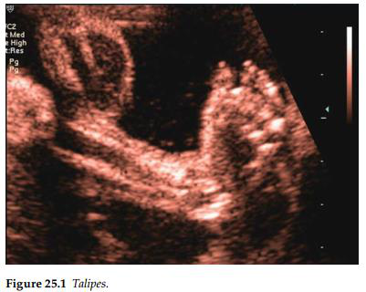
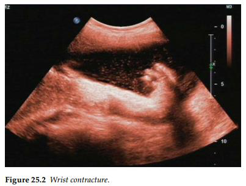

Thông thường, các bất thường về khớp chỉ được chẩn đoán trước sinh khi chúng ở mức độ nghiêm
trọng. Tuy nhiên, việc chẩn đoán dương tính giả vẫn có thể xảy ra do khả năng vận động khớp tự
nhiên của thai nhi, và ảnh hưởng của tử cung chật chội do vào giai đoạn muộn của thai kỳ, thiểu
ối hoặc mang đa thai.

## Chân khoèo (Talipes)

Chân khoèo là một dị tật vẹo trong của bàn chân. Khi được chẩn đoán trước sinh, dị tật này
xảy ra do sự phân bố thần kinh bất thường của các cơ thuộc khớp cổ chân. Nếu tổn thương xuất hiện ở một bên và đơn độc, tiên lượng sẽ rất tốt.
Ngược lại, một tỷ lệ lớn các trường hợp chân khoèo thể phức tạp hoặc bị cả hai bên có sự
liên kết chặt chẽ với các bất thường nhiễm sắc thể, các hội chứng di truyền hoặc các rối
loạn phát triển thần kinh.

## Co cứng gấp cố định nhiều khớp (Fixed flexion of multiple joints)

Những phát hiện này nằm dưới thuật ngữ chung là Hội chứng cứng khớp đa bẩm sinh
(Arthrogryposis multiplex congenita), thuật ngữ này bao hàm nhiều chứng rối loạn thần kinh
cơ khác nhau với tiên lượng sau sinh cần rất dè dặt. Việc tìm thấy các màng da tại vị trí các khớp là biểu hiện điển hình của hội chứng đa màng (multiple pterygium syndrome). Tình trạng các bất thường chỉ khu trú ở chi dưới đi kèm với sự kết thúc đột ngột của cột
sống là đặc trưng của hội chứng thoái triển vùng đuôi (caudal regression syndrome), thường liên quan đến tiểu đường thai kỳ. Nếu các bất thường về chiều dài xương dài, quá trình khoáng hóa xương hoặc các vết gãy
xương, bác sĩ cần phải nghi ngờ đến bệnh lý loạn sản hệ xương.

## Bất thường trương lực cơ / Tư thế (Abnormal tone/posture)

Hiếm khi, tư thế hoặc trương lực cơ bất thường có thể được ghi nhận tại các khớp của thai nhi,
gợi ý đến một chứng rối loạn thần kinh cơ, chẳng hạn như chuỗi biểu hiện Pena–Shokeir.
Bệnh lý này chỉ nên được nghi ngờ nếu tư thế của thai nhi liên tục bị bất thường (cố định,
không thay đổi) qua nhiều lần siêu âm vào các thời điểm khác nhau.

## Tài liệu tham khảo

1. Bakalis S, Sairam S, Homfray T, Harrington KF, Nicolaides K, Thilaganathan B. Outcome of antenatally diagnosed talipes equinovarus in an unselected obstetric population. _Ultrasound Obstet Gynecol_ 2002; 20: 226–9.
2. Bonilla-Musoles F, Machado LE, Osborne NG. Multiple congenital contractures (congenital multiple arthrogryposis). _J Perinat Med_. 2002; 30(1): 99–104.

