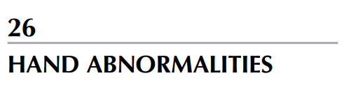
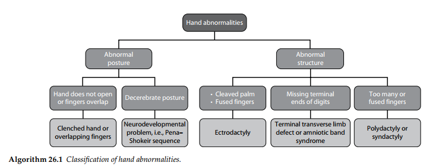
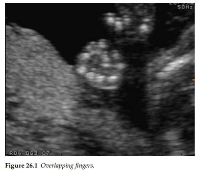
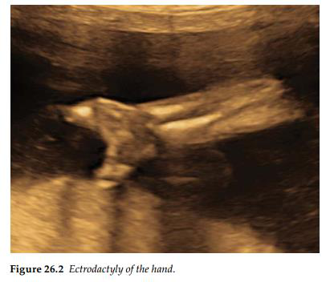

Thông thường, các bất thường ở bàn tay chỉ được ghi nhận trong quá trình khảo sát kỹ lưỡng hình

thái thai nhi sau khi một dị tật khác đã được chẩn đoán. Trong những bối cảnh này, các dị tật ở bàn

tay nhiều khả năng có liên quan đến một bất thường di truyền hoặc bất thường nhiễm sắc thể đã

được xác định.

- Bất thường cử động / Tư thế bàn tay (Abnormal hand movement/posture)

Sự hiện diện của dấu hiệu các ngón tay chồng chéo lên nhau (overlapping fingers) hoặc bàn

tay nắm chặt (clenched hand) gợi ý đến một rối loạn nhiễm sắc thể, chẳng hạn như trisomy 18

(hội chứng Edwards), hoặc một rối loạn thần kinh cơ như chuỗi biểu hiện Pena–Shokeir. Nếu

bàn tay giữ nguyên ở tư thế mất não (decerebrate) và vẹo hướng vào trong, cần phải nghi ngờ

đến dị tật của trục xương quay hoặc một vấn đề về phát triển hệ thần kinh.

- Bất thường cấu trúc bàn tay (Abnormal hand structure)

Dị tật thừa ngón (polydactyly) là một phát hiện đơn độc thường gặp và có tiên lượng rất tốt.

Các đặc điểm liên quan khẳng định một chẩn đoán như hội chứng trisomy, loạn sản hệ xương,

hội chứng Meckel–Gruber, và hội chứng Smith–Lemli–Opitz. Tình trạng thiếu ngón hoặc các

ngón tay bị ngắn lại bất thường từ sớm là đặc trưng của hội chứng dải sợi ối (amniotic band

syndrome) và các dị tật cụt ngang chi đoạn tận cùng. Trong khi đó, dị tật bàn tay nứt đôi (split-

hand) hay bàn tay "càng tôm hùm" (lobster-claw) lại gợi ý đến tật chẻ ngón (ectrodactyly).

Giải thích sơ đồ:

BẤT THƯỜNG BÀN TAY

NHÁNH 1 (BÊN TRÁI): Tư thế bất thường

- Bàn tay không mở hoặc các ngón tay chồng chéo lên nhau:

 Bàn tay nắm chặt hoặc các ngón tay chồng chéo.

- Tư thế mất não:

 Vấn đề về phát triển hệ thần kinh, ví dụ: Chuỗi biểu hiện Pena–Shokeir.

NHÁNH 2 (BÊN PHẢI): Cấu trúc bất thường

- Lòng bàn tay bị nứt đôi/ Các ngón tay dính liền nhau.

 Tật bàn tay trẻ.

- Thiếu các đoạn tận cùng của ngón tay:

 Dị tật cụt ngang chi đoạn tận cùng hoặc Hội chứng dải sợi ối.

- Quá nhiều ngón hoặc các ngón dính nhau:

 Tật thừa ngón hoặc Tật dính ngón.

