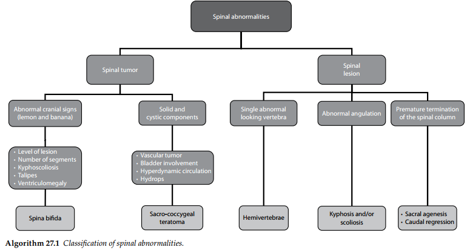
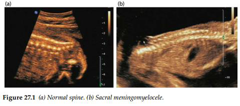
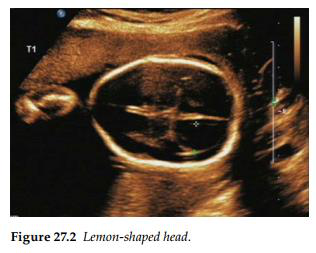
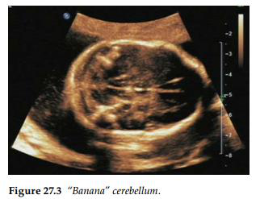
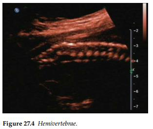
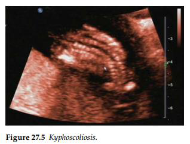
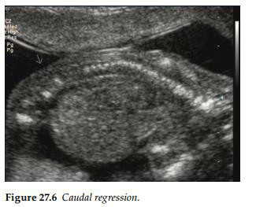

Bất thường cột sống thường gặp nhất trong chẩn đoán trước sinh là tật nứt đốt sống (spina bifida).
Mặc dù các tổn thương cột sống khác vẫn có thể xảy ra, nhưng tần suất xuất hiện của chúng tương
đối hiếm.

## Tật nứt đốt sống (Spina bifida)

Thông thường, dị tật này được chẩn đoán thông qua việc phát hiện các dấu hiệu đặc trưng bao
gồm đầu hình quả chanh (lemon-shaped head) và tiểu não hình quả chuối ("banana"
cerebellum). Tiên lượng đối với trẻ sơ sinh sẽ được quyết định bởi vị trí tổn thương (đốt sống cao hay
thấp), số lượng các đoạn đốt sống bị ảnh hưởng, mức độ nghiêm trọng của tình trạng gù
vẹo cột sống, giãn não thất và tật đầu nhỏ.

## U quái vùng cùng cụt (Sacrococcygeal teratoma)

U quái vùng cùng cụt thường biểu hiện dưới dạng một khối u giàu mạch máu, có cấu trúc
dạng bán đặc/bán nang nằm ở đoạn tận cùng của cột sống. Khối u quái vùng cùng cụt có liên
quan đến tình trạng phù thai và đa ối, là hệ quả từ sự suy tim cung lượng cao do hiện tượng
thông động - tĩnh mạch ngay bên trong khối u.
Những khối u này rất hiếm khi là u ác tính, và tiên lượng thường rất tốt sau
khi tiến hành phẫu thuật cắt bỏ.

## Góc cong cột sống bất thường (Spinal angulation)

Tật nửa đốt sống (hemivertebrae) hiếm khi được chẩn đoán trước sinh, nguyên nhân có lẽ do
tỷ lệ lưu hành thấp và việc chẩn đoán qua hình ảnh siêu âm tương đối khó khăn. Hầu hết các
trường hợp đều có tiên lượng tốt, nhưng bác sĩ cần phải cân nhắc đến chẩn đoán hội chứng
VATER hoặc VACTERL. Tình trạng gù cột sống (độ gù nhô lên quá mức) và vẹo cột sống
(biến dạng lệch sang bên) có thể được chẩn đoán trước sinh dưới dạng các bất thường đơn độc.
Trong một số trường hợp, chúng có thể đi kèm với tật nứt đốt sống, dị tật cuống thân (body
stalk anomaly) và loạn sản hệ xương.

## Hội chứng thoái triển vùng đuôi (Caudal regression)

Hội chứng thoái triển vùng đuôi có mức độ nghiêm trọng thay đổi từ bất sản một phần xương
cùng cho đến sự vắng mặt hoàn toàn của cột sống thắt lưng - cùng. Ở thể nặng nhất (tật chân
nàng tiên cá - sirenomelia), hội chứng này biểu hiện bằng sự dính liền và thiểu sản của các chi
dưới cũng như các cấu trúc vùng chậu. Hội chứng thoái triển vùng đuôi xảy ra phổ biến hơn ở
mẹ bị bệnh tiểu đường thai kỳ.

## Tài liệu tham khảo

1. Mitchell LE, Adzick NS, Melchionne J et al. Spina bifida. _Lancet_. 2004 Nov 20–26; 364(9448): 1885–95.
2. Nyberg DA. The fetal central nervous system. _Semin Roentgenol_. 1990 Oct; 25(4): 317–33.

