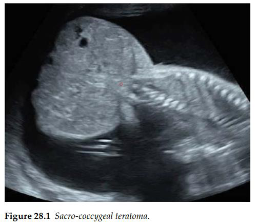
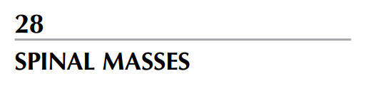
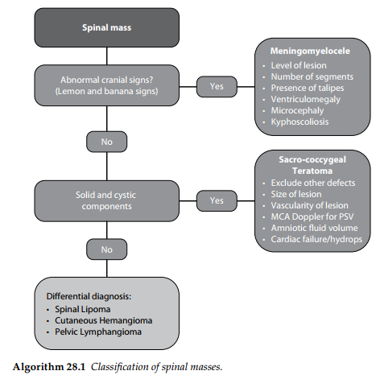

U quái vùng cùng cụt (Sacrococcygeal teratoma) là loại u thai nhi phổ biến nhất, với tỷ lệ mắc

khoảng 1 trên 40.000 trẻ sinh ra. Những khối u này có nguồn gốc từ các tế bào phôi thai vạn năng,

và hầu hết chúng là các khối u phát triển ra phía ngoài cơ thể với một phần cấu trúc nằm bên trong

vùng chậu có kích thước thay đổi, xuất phát từ mức xương cùng tới xương cụt.

Chúng có thể có kích thước rất lớn và thường có cấu trúc không đồng nhất, bao gồm cả các thành

phần dạng nang và dạng đặc.

Tình trạng đa ối có thể tiến triển thứ phát sau hiện tượng tuần hoàn tăng động, hoặc do tình trạng

thiếu máu là hệ quả của xuất huyết bên trong khối u.

Tiên lượng: Phần lớn các u quái vùng cùng cụt là lành tính, với chưa đến 10% trường hợp xuất

hiện thành phần ác tính. Những khối u phát triển nhanh, khối u có phần nằm trong phúc mạc lớn,

cùng với sự xuất hiện của tình trạng đa ối hoặc phù thai là những yếu tố liên quan đến tiên lượng

tồi tệ nhất.

Dịch bảng:

Có dấu hiệu sọ não bất thường? - Hình quả chanh và quả chuối ?

KHỐI U CỘT SỐNG

 CÓ  Thoát vị tủy - màng tủy.

o Các yếu tố cần đánh giá:

 Mức độ tổn thương

 Số lượng đoạn bị ảnh hưởng

 Sự hiện diện của tật chân khoèo

 Giãn não thất

 Tật đầu nhỏ

 Tật gù vẹo cột sống

- KHÔNG  Có thành phần dạng đặc và dạng nang?

o CÓ  U quái vùng cùng cụt.

o Các yếu tố cần đánh giá:

 Loại trừ các dị tật khác

 Kích thước tổn thương

 Mức độ tăng sinh mạch máu của tổn thương

 Doppler động mạch não giữa để đo PSV

 Thể tích nước ối

 Suy tim / Phù thai

o KHÔNG  Chuyển xuống bước chẩn đoán phân biệt cuối cùng:

- Chẩn đoán phân biệt (Differential diagnosis):

- U mỡ cột sống

- U máu ngoài da

- U mạch bạch huyết vùng chậu
