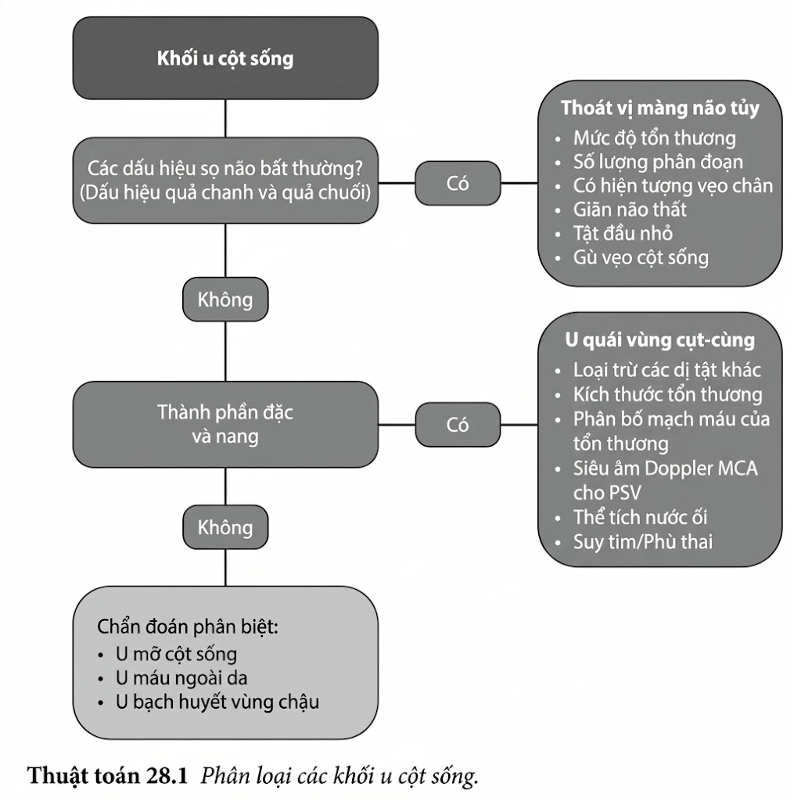
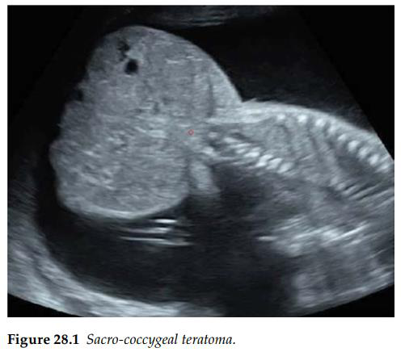

U quái vùng cùng cụt (Sacrococcygeal teratoma) là loại u thai nhi phổ biến nhất, với tỷ lệ mắc
khoảng 1 trên 40.000 trẻ sinh ra. Những khối u này có nguồn gốc từ các tế bào phôi thai vạn năng,
và hầu hết chúng là các khối u phát triển ra phía ngoài cơ thể với một phần cấu trúc nằm bên trong
vùng chậu có kích thước thay đổi, xuất phát từ mức xương cùng tới xương cụt.
Chúng có thể có kích thước rất lớn và thường có cấu trúc không đồng nhất, bao gồm cả các thành
phần dạng nang và dạng đặc. Tình trạng đa ối có thể tiến triển thứ phát sau hiện tượng tuần hoàn tăng động, hoặc do tình trạng
thiếu máu là hệ quả của xuất huyết bên trong khối u. Phần lớn các u quái vùng cùng cụt là lành tính, với chưa đến 10% trường hợp xuất
hiện thành phần ác tính. Những khối u phát triển nhanh, khối u có phần nằm trong phúc mạc lớn,
cùng với sự xuất hiện của tình trạng đa ối hoặc phù thai là những yếu tố liên quan đến tiên lượng
tồi tệ nhất.

**Tài liệu tham khảo**

1. Sananes N, Javadian P, Schwach Werneck Britto I et al. Technical aspects and effectiveness of percutaneous fetal therapies for large sacrococcygeal teratomas: Cohort study and literature review. _Ultrasound Obstet Gynecol_. 2016; 47: 712–9.

