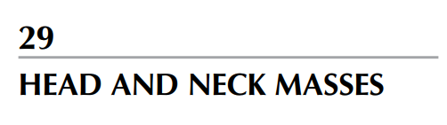
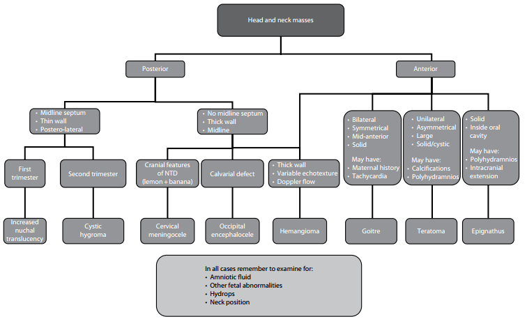
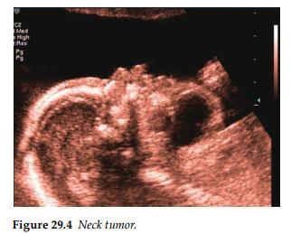
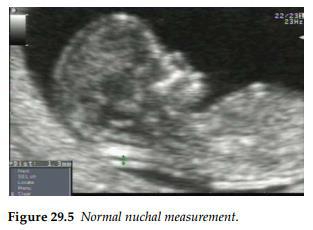
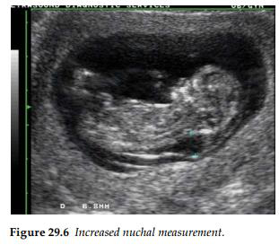

Các khối u vùng đầu và cổ ở thai nhi rất hiếm gặp. Khi phát hiện thấy các khối này, việc đánh

giá thể tích nước ối là vô cùng quan trọng, bởi vì tình trạng đa ối sẽ gợi ý các vấn đề liên quan đến

phản xạ nuốt hoặc tắc nghẽn. Thêm vào đó, việc khảo sát kỹ lưỡng hình thái giải phẫu của thai nhi

là cần thiết, vì các dị tật đi kèm có thể gợi ý một bất thường nhiễm sắc thể hoặc hội chứng di truyền

tiềm ẩn.

Tiên lượng của các khối u này phần lớn phụ thuộc vào kích thước của chúng. Nếu khối u có

kích thước lớn, chúng có thể gây chèn ép khí quản, đồng nghĩa với việc đường thở của trẻ sơ sinh

không thể được duy trì sau khi ra đời. Việc theo dõi chặt chẽ kích thước khối u là bắt buộc để

quyết định xem có cần thực hiện Liệu pháp điều trị ngoài tử cung trong quá trình sinh (EXIT

- Ex utero intrapartum treatment) ngay khi trẻ chào đời hay không (xem phần thảo luận chi tiết

ở cuối bài). Các yếu tố quan trọng khác quyết định tiên lượng bao gồm sự hiện diện của các dị tật

đi kèm, phù thai (có thể xảy ra ở các khối u giàu mạch máu) và đa ối (do nguy cơ gây sinh non).

- U quái vùng cổ (Cervical teratoma)

Khối u vùng cổ cực kỳ hiếm gặp này được cấu tạo từ các mô có nguồn gốc từ nhiều lá phôi

khác nhau (thường bao gồm mô thần kinh, da, sụn, xương và tuyến giáp). Điều này dẫn đến

một hình ảnh không đồng nhất trên siêu âm. Thông thường, các khối u này xuất hiện ở một

bên, là khối dạng đặc - nang, có nhiều vách ngăn với kích thước đo được từ 5–12 cm, và có

hiện tượng vôi hóa xuất hiện trong khoảng một nửa số trường hợp. Vì kích thước lớn, chúng

thường xuyên gây tắc nghẽn đường thở, dẫn đến đa ối trong 20%–40% các trường hợp. Việc

phẫu thuật sửa chữa sau sinh thường đòi hỏi phải bóc tách vùng cổ trên diện rộng, và thường

phải thực hiện nhiều lần phẫu thuật để cắt bỏ hoàn toàn khối u nhằm đạt được kết quả thẩm

mỹ. Về lâu dài, trẻ sơ sinh có nguy cơ bị suy giáp và suy tuyến cận giáp.

- U xương hàm (Epignathus)

Đây là một khối u vùng hầu họng cực kỳ hiếm gặp, được phân loại là u quái trưởng thành.

Chúng xuất phát từ xương bướm, vòm miệng, hầu hoặc hàm và phát triển vào bên trong khoang

miệng, khoang mũi hoặc xâm lấn vào trong hộp sọ.

Trên hình ảnh siêu âm, đây là một khối u đặc nằm trong khoang miệng và thường đi kèm với

tình trạng đa ối. Khối u này thường tăng sinh mạch máu rất mạnh, có thể dẫn đến tình trạng

mất bù tim và phù thai. Cấu trúc giải phẫu của não phải được kiểm tra cực kỳ cẩn thận vì khối

u có thể xâm lấn vào nội sọ. Ngoài ra, khối u có thể đi kèm với dị tật hở hàm ếch và tật hàm

nhỏ (micrognathia). Tiên lượng của bệnh rất tồi tệ do tắc nghẽn đường thở, và thông thường

sẽ cần phải thực hiện thủ thuật EXIT.

- Bướu cổ thai nhi (Fetal goiter)

Đây là tình trạng phì đại tuyến giáp của thai nhi.

Nguyên nhân có thể do người mẹ bị cường giáp hoặc suy giáp, nhưng dị tật này cũng đã được

ghi nhận ở những người mẹ có chức năng tuyến giáp bình thường.

Các đặc điểm trên siêu âm là một khối đặc nằm ở phía trước cổ và có tính chất đối xứng, có

thể khiến đầu thai nhi bị ngửa ra sau quá mức. Bướu cổ có thể gây ra đa ối, và tư thế ngửa cổ

quá mức có thể dẫn đến tình trạng đẻ khó (dystocia). Trong hầu hết các trường hợp, người mẹ

đều có tiền sử mắc bệnh lý tuyến giáp, và việc điều trị cho người mẹ thường sẽ giúp cải thiện

tình trạng cường giáp của thai nhi. Trong một số ca lâm sàng, việc lấy máu thai nhi có thể cần

thiết để xác định tình trạng tuyến giáp của trẻ, và các biện pháp điều trị trực tiếp cho thai nhi

thông qua chọc ối hoặc chọc hút máu cuống rốn cũng đã được báo cáo.

- U nang bạch huyết (Cystic hygroma)

Đây là nguyên nhân phổ biến nhất đối với một phát hiện trước sinh về khối u vùng cổ và được

cho là do bất thường bẩm sinh của hệ bạch huyết. Trong tam cá nguyệt thứ nhất, u bạch mạch

dạng nang có thể được nhận diện thông qua dấu hiệu tăng độ mờ da gáy tại thời điểm siêu âm

tuần 11–13+6. Chẩn đoán trong tam cá nguyệt thứ hai dựa trên phát hiện siêu âm về một khối

dạng nang, thành mỏng nằm ở phía sau cổ, với đặc trưng là có một vách ngăn ở đường giữa

(dây chằng gáy). Khối này thường có nhiều vách ngăn và có tính chất đối xứng.

U nang bạch huyết có thể phát triển rất lớn, và trong những trường hợp này, chúng có thể lan

rộng ra phía trước, vào vùng nách hoặc vào trung thất.

Sự hiện diện của tình trạng phù thai (hydrops fetalis) là một dấu hiệu tiên lượng rất xấu, đi kèm

với tỷ lệ tử vong &gt;95%. U nang bạch huyết ở thai nhi có mối liên hệ chặt chẽ với các bất

thường nhiễm sắc thể tiềm ẩn (đặc biệt là hội chứng Turner và các thể lệch bội nhiễm sắc thể)

cùng các hội chứng di truyền (ví dụ: hội chứng Noonan, hội chứng Joubert).

Cần tiến hành siêu âm hình thái học chi tiết, bao gồm cả siêu âm tim thai để tìm kiếm các đặc

điểm khác của những bất thường này, và cha mẹ nên được tư vấn lựa chọn làm xét nghiệm

nhiễm sắc thể đồ của thai nhi. Các khối u bạch mạch có kích thước nhỏ và được phát hiện

muộn trong thai kỳ sẽ có tiên lượng tốt hơn. Trong số đó, nhiều trường hợp tự thoái triển (tự

biến mất), và việc điều trị sau sinh chủ yếu nhằm mục đích giải quyết tình trạng tắc nghẽn cơ

học và cải thiện thẩm mỹ.

- U máu thai nhi (Fetal hemangioma)

U máu thai nhi ảnh hưởng đến vùng cổ hoặc vùng mặt là một bệnh lý hiếm gặp, xuất hiện trên

siêu âm dưới dạng một khối trống âm (vùng đen chứa dịch) có thành dày, bên trong phát hiện

được các tín hiệu dòng chảy mạch đập đặc trưng trên phổ Doppler. Khi sinh ra, trẻ sẽ có một

khối u màu tím tím với các mạch máu bị giãn rộng.

Theo mô tả kinh điển, khối u này đã phát triển hoàn chỉnh ngay khi sinh và sẽ thoái triển

(teo nhỏ) nhanh chóng trong vòng 6–18 tháng sau sinh.

- Liệu pháp điều trị trong cuộc sinh khi chưa cắt rốn (Thủ thuật EXIT)

Thủ thuật này được áp dụng cho những thai nhi có khối u vùng cổ kích thước lớn hoặc bị teo

thanh - khí quản, do tỷ lệ tử vong chu sinh rất cao nếu có sự chậm trễ trong việc thiết lập đường

thở và thực hiện thông khí hiệu quả cho trẻ. Mục tiêu của thủ thuật này là kéo dài thời gian

để thiết lập đường thở an toàn cho trẻ sơ sinh trong khi vẫn duy trì quá trình trao đổi

khí qua tuần hoàn nhau thai. Điều này được thực hiện bằng cách đặt nội khí quản hoặc mở

khí quản, mặc dù việc nội soi phế quản và cắt bỏ khối u vùng cổ ngay tại thời điểm đó cũng đã

được mô tả trong y văn.

Trong các trường hợp có đa ối đi kèm, việc chọc hút bớt nước ối (amnioreduction) trước khi

tiến hành thủ thuật đã được báo cáo nhằm ngăn chặn tình trạng giảm áp lực đột ngột và co rút

của tử cung. Quá trình gây mê toàn thân kết hợp với sử dụng thuốc làm giãn cơ tử cung nhằm

bảo tồn chức năng bánh nhau sẽ được thực hiện trước khi tiến hành mổ lấy thai. Bác sĩ sẽ đảm

bảo cầm máu kỹ lưỡng trong suốt thủ thuật, và tử cung được mở bằng một thiết bị dập ghim

chuyên dụng để giảm thiểu tối đa lượng máu mất của người mẹ. Thai nhi được đưa ra ngoài

một phần trong khi hệ tuần hoàn nhau - thai vẫn còn nguyên vẹn để tiếp tục cung cấp oxy

và trao đổi khí; đường thở của trẻ sẽ được thiết lập và bảo vệ an toàn trước khi bác sĩ tiến hành

kẹp và cắt dây rốn.

Algorithm 29.1 Classification of head and neck masses

DỊCH BẢNG:

KHỐI U VÙNG ĐẦU VÀ CỔ

NHÁNH 1: Phía sau

- Có vách ngăn đường giữa, thành mỏng, vị trí sau – bên:

o Tam cá nguyệt thứ nhất  Tăng độ mờ da gáy.

o Tam cá nguyệt thứ hai  Nang bạch huyết.

- Không có vách ngăn đường giữa, thành dày, nằm ở đường giữa:

o Có các dấu hiệu sọ não của dị tật ống thần kinh - hình quả chanh + quả chuối

Thoát vị màng não vùng cổ.

o Có khuyết xương sọ  Thoát vị não vùng chẩm.

- Thành dày, cấu trúc âm vang thay đổi, có dòng chảy mạch máu trên Doppler  U máu.

NHÁNH 2: Phía trước

- Thành dày, cấu trúc âm vang thay đổi, có dòng chảy mạch máu trên Doppler  U máu.

- Đối xứng hai bên, vị trí trước - giữa, dạng đặc:

o Có thể có: Tiền sử bệnh lý từ người mẹ, Tim thai nhanh.

 Bướu cổ thai nhi.

- Một bên, không đối xứng, kích thước lớn, dạng đặc/nang:

o Có thể có: Nốt vôi hóa, Đa ối.

 U quái.

- Dạng đặc, nằm bên trong khoang miệng:

o Có thể có: Đa ối, xâm lấn vào nội sọ.

 U xương hàm.

Trong tất cả các trường hợp, hãy lưu ý luôn phải kiểm tra:

- Nước ối (Amniotic fluid)

- Các bất thường khác của thai nhi (Other fetal abnormalities)

- Tình trạng phù thai (Hydrops)

- Tư thế của cổ (Neck position)

