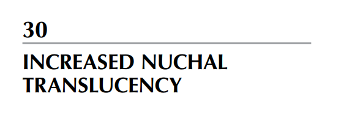
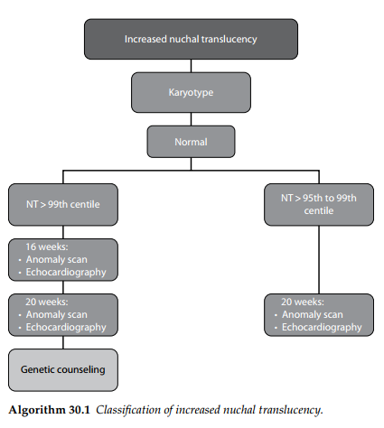
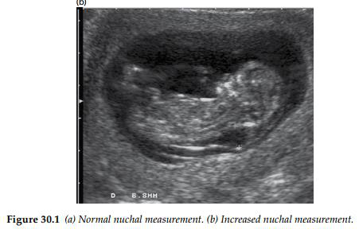
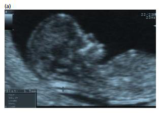

Tất cả thai nhi đều có một lớp dịch tích tụ dưới da ở vùng sau gáy vào thời điểm 11 đến 13 tuần +

6 ngày của thai kỳ. Khoảng sáng sau gáy (NT) này có thể quan sát và đo đạc được trên hình ảnh

siêu âm. Có rất nhiều nguyên nhân dẫn đến tình trạng tăng khoảng sáng sau gáy, và có thể không

chỉ do một cơ chế bệnh sinh đơn lẻ cho sự hiện diện của nó.

- Bất thường nhiễm sắc thể (Chromosomal abnormalities)

Khoảng sáng sau gáy (NT) là dấu hiệu chỉ điểm đơn độc quan trọng nhất đối với các bất thường

nhiễm sắc thể trong tam cá nguyệt thứ nhất, và là dấu hiệu được nghiên cứu rộng rãi nhất. Việc

sàng lọc hội chứng Down (trisomy 21) bằng cách kết hợp chỉ số NT với tuổi mẹ và xét nghiệm

sinh hóa máu mẹ cho tỷ lệ phát hiện khoảng 80% số trường hợp, với tỷ lệ phải thực hiện xét

nghiệm xâm lấn là 3%. Chỉ số NT cũng tăng lên trong các bất thường nhiễm sắc thể khác, và

một chương trình sàng lọc hội chứng Down cũng sẽ giúp phát hiện ra đại đa số thai nhi mắc

các thể tam nhiễm (trisomy) khác.

- Dị tật tim (Cardiac defects)

Các bất thường về tim có sự liên kết chặt chẽ với tình trạng tăng độ dày của khoảng sáng sau

gáy ở những thai nhi có bộ nhiễm sắc thể bình thường. Tỷ lệ lưu hành của các dị tật tim là

khoảng 7% nếu chỉ số NT từ 4.5–5.4 mm, tăng lên 20% khi NT đạt 5.5–6.4 mm, và lên tới

30% đối với các trường hợp NT từ 6.5 mm trở lên. Việc sử dụng NT như một xét nghiệm sàng

lọc các dị tật tim lớn sẽ cải thiện đáng kể tỷ lệ phát hiện các bất thường về tim mạch. Trong

các thai kỳ có tình trạng tăng khoảng sáng sau gáy, việc tiến hành siêu âm tim thai chuyên sâu

cần được cân nhắc đối với những thai nhi có chỉ số NT vượt quá bách phân vị thứ 95.

- Dị tật thai nhi và rối loạn vận động (Fetal abnormalities and movement disorders)

Tình trạng tăng khoảng sáng sau gáy ở thai nhi đi kèm với tỷ lệ cao của các dị tật bẩm sinh lớn

ở thai nhi. Danh sách các dị tật liên quan đến tăng NT ngày càng kéo dài, trong đó các tổn

thương phổ biến bao gồm phù thai, thoát vị hoành bẩm sinh, thoát vị rốn, dị tật cuống thân, các

bất thường hệ xương, và các rối loạn vận động của thai nhi như chuỗi biến dạng mất vận động

thai nhi (fetal akinesia deformation sequence). Do đó, một cuộc khảo sát hình thái học kỹ

lưỡng cần phải được thực hiện ở những thai nhi có bộ nhiễm sắc thể bình thường nhưng có

tình trạng tăng NT.

- Các hội chứng di truyền (Genetic syndromes)

Tình trạng tăng NT cũng có mối liên hệ với một số lượng lớn các hội chứng di truyền. Tính

chất hiếm gặp của các hội chứng này khiến việc xác định xem tỷ lệ lưu hành quan sát được có

thực sự cao hơn quần thể chung hay không trở nên khó khăn; tuy nhiên, có vẻ như bệnh tăng

sản thượng thận bẩm sinh, chuỗi biến dạng do mất vận động, hội chứng Noonan, hội chứng

Smith–Lemli–Opitz và bệnh teo cơ tủy sống xuất hiện với tần suất cao hơn kỳ vọng so với

quần thể chung.

Dịch bảng này:

TĂNG KHOẢNG SÁNG SAU GÁY

 Làm Nhiễm sắc thể đồ  Kết quả Bình thường.

- NT vượt bách phân vị thứ 99

- Tại tuần thứ 16:

o Siêu âm hình thái học sớm

o Siêu âm tim thai.

- Tại tuần thứ 20:

o Siêu âm hình thái học chi tiết.

o Siêu âm tim thai chuyên sâu.

- Tư vấn di truyền.

- NT nằm giữa bách phân vị thứ 95 và 99:

- Tại tuần thứ 20:

o Siêu âm hình thái học chi tiết.

o Siêu âm tim thai.

