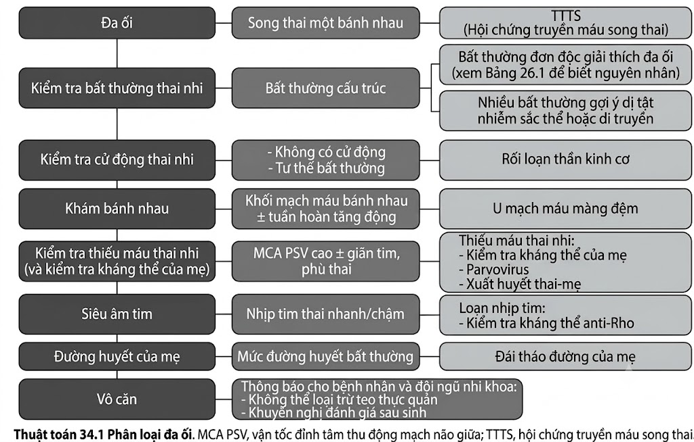
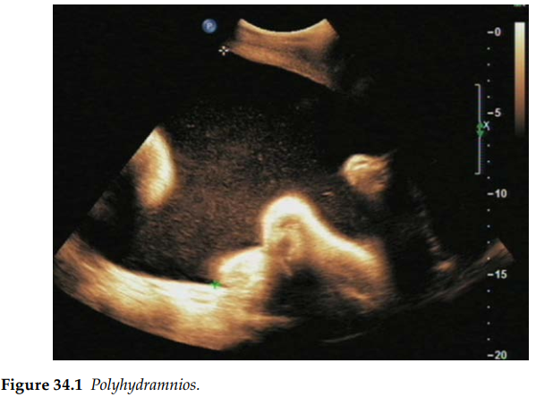

Tình trạng đa ối xảy ra do sự giảm phản xạ nuốt của thai nhi hoặc do sự gia tăng sản xuất nước
tiểu của thai nhi. Bệnh lý này xuất hiện ở 0,5%–1% tổng số các thai kỳ. Chẩn đoán thường được
đưa ra mang tính chủ quan của bác sĩ. Nó được định nghĩa là chỉ số nước ối (AFI) trên 24 cm hoặc
phép đo xoang ối sâu nhất đạt ít nhất từ 8 cm trở lên. Tiên lượng của thai kỳ phụ thuộc hoàn toàn vào nguyên nhân gây ra nó, tuy nhiên tỷ lệ tử vong
chu sinh ở nhóm đa ối cao gấp khoảng 2 đến 3 lần so với các thai kỳ có thể tích nước ối bình
thường, ngay cả khi thai nhi không có dị tật kèm theo. Nếu tình trạng đa ối đi kèm với một dị tật
ở thai nhi hoặc bất thường ở bánh nhau, tỷ lệ tử vong chu sinh có thể lên tới 60%.

Các biến chứng của đa ối bao gồm chuyển dạ sinh non (ảnh hưởng đến 1 trong mỗi 4 trường hợp),
ngôi thai bất thường dẫn đến chỉ định mổ lấy thai, nhau bong non và băng huyết sau sinh. Thủ
thuật chọc hút bớt nước ối (amniodrainage) trong điều trị đa ối nhằm mục đích làm giảm nguy cơ
sinh non và cải thiện tình trạng khó chịu của người mẹ. Tương tự như đối với tất cả các bất thường
khác, cần tiến hành siêu âm đích chi tiết để tìm kiếm các dị tật đi kèm. Có khoảng 20% các trường
hợp đa ối xuất hiện dị tật thai nhi đi kèm.

**Bất thường cấu trúc thai nhi (Fetal structural abnormalities)**

Các dị tật đi kèm phổ biến nhất là các bất thường thuộc hệ tiêu hóa hoặc hệ thần kinh trung
ương. Sự hiện diện của đa dị tật hoặc các bất thường không giải thích được nguyên nhân gây
đa ối cần nghi ngờ về một bất thường nhiễm sắc thể hoặc hội chứng di truyền tiềm ẩn. Trong
các trường hợp đa ối do tắc nghẽn, chẳng hạn như dị tật hệ tiêu hóa hoặc bất thường ở phổi,
tình trạng đa ối có thể tiến triển rất nghiêm trọng và tái phát nhanh chóng sau khi chọc hút ối,
thường đòi hỏi phải tiến hành hút ối định kỳ nhiều lần.

**Rối loạn vận động của thai nhi (Fetal movement disorders)**

Tình trạng thai nhi không cử động hoặc giảm cử động nghiêm trọng có thể là dấu hiệu gợi ý
một bệnh lý rối loạn thần kinh cơ (thường mang tính chất tiến triển).

**Khối u bánh nhau (Placental tumors)**

Sự hiện diện của một khối u bánh nhau, chẳng hạn như u mạch máu bánh nhau
(chorioangioma), có thể gây ra hiện tượng tuần hoàn tăng động, dẫn đến vận tốc đỉnh tâm thu
(PSV) tăng cao khi đo Doppler động mạch não giữa (MCA).

**Thiếu máu thai nhi (Fetal anemia)**

Khảo sát Doppler động mạch não giữa (MCA) sẽ ghi nhận chỉ số PSV tăng cao. Tình trạng
tràn dịch dưới da thai, cổ trướng hoặc phù thai (hydrops) có thể xuất hiện nếu tình trạng thiếu
máu ở mức độ nghiêm trọng. Người mẹ có thể có tiền sử mang kháng thể bất thường do đồng
miễn dịch (alloimmune antibodies), hoặc có tiền sử lâm sàng/kết quả xét nghiệm máu gợi ý
tình trạng nhiễm virus Parvovirus. Thiếu máu thai nhi có thể được điều trị bằng liệu pháp
truyền máu cho thai nhi trong tử cung. Trong các trường hợp thiếu máu do cơ chế miễn dịch,
việc truyền máu lặp lại nhiều lần thường là bắt buộc; trong khi đó đối với nhiễm Parvovirus,
một đợt truyền máu duy nhất thường là đủ do thai nhi có khả năng tự phục hồi sau đợt bệnh.

**Rối loạn nhịp tim (Arrhythmias)**

Cần tiến hành thăm khám kỹ lưỡng tim thai bao gồm cả đánh giá nhịp tim để loại trừ các bệnh
lý như nhịp nhanh trên thất ở thai nhi (supraventricular tachycardia) hoặc block tim (block dẫn
truyền). Chỉ định điều trị được đưa ra nếu xuất hiện các dấu hiệu thai suy, chẳng hạn như phù
thai. Nhiều dạng rối loạn nhịp tim thai có thể được điều trị bằng cách cho người mẹ uống thuốc
chống loạn nhịp (điều trị qua nhau thai).

**Tài liệu tham khảo**

1. Biggio JR Jr, Wenstrom KD, Dubard MB et al. Hydramnios prediction of adverse perinatal outcome. _Obstet Gynecol_. 1999 Nov; 94(5 Pt 1): 773–7.
2. Locatelli A, Vergani P, Di Pirro G et al. Role of amnioinfusion in the management of premature rupture of the membranes at &lt;26 weeks’ gestation. _Am J Obstet Gynecol_. 2000 Oct; 183(4): 878–82.
3. Newbould MJ, Lendon M, Barson AJ. Oligohydramnios sequence: The spectrum of renal malformations. _Br J Obstet Gynaecol_. 1994 Jul; 101(7): 598–604.

