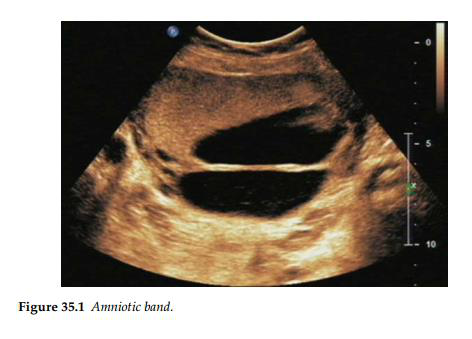

Các dải sợi ối hình thành như một hệ quả từ sự rách vỡ của màng ối trong bối cảnh màng đệm vẫn

còn nguyên vẹn. Trong hầu hết các trường hợp, dải sợi ối xuất hiện mà không gây ra bất kỳ ảnh

hưởng nào đến thai nhi, mặc dù đôi khi một chẩn đoán về hội chứng dải sợi ối có thể được đưa

ra bởi vì liên quan đến các dị tật thai nhi.

Hội chứng dải sợi ối được cho là xảy ra do các bộ phận của thai nhi (thường là một chi hoặc các

ngón tay/ngón chân) bị mắc kẹt vào màng ối dạng sợi trong quá trình phát triển ở tử cung. Khi

màng ối bị rách, các bộ phận của thai nhi có thể lồi vào khoang ngoài phôi, và màng ối có thể quấn

chặt lấy các cơ quan khác nhau của thai nhi, từ đó làm giảm nguồn cung cấp máu và gây ra các dị

tật bẩm sinh (điển hình dẫn đến kết cục cụt chi/ngón tự nhiên).

Mặc dù không có hai ca bệnh nào hoàn toàn giống nhau, nhưng có một vài đặc điểm tương đối

phổ biến bao gồm: tật dính ngón (syndactyly), các vòng thắt siết ở đoạn xa chi (distal ring

constrictions), sự phát triển xương bị rút ngắn, sự chênh lệch chiều dài giữa các chi, phù mạch

bạch huyết đoạn xa chi và các dải sợi bẩm sinh.

Một điều rất dễ gây nhầm lẫn là tại thời điểm hội chứng dải sợi ối được nghi ngờ, các dải sợi ối

này thường không còn khả năng quan sát thấy trên siêu âm nữa, bởi vì tổn thương bám siết đối với

thai nhi có thể đã xảy ra từ rất sớm trong tam cá nguyệt thứ nhất.

