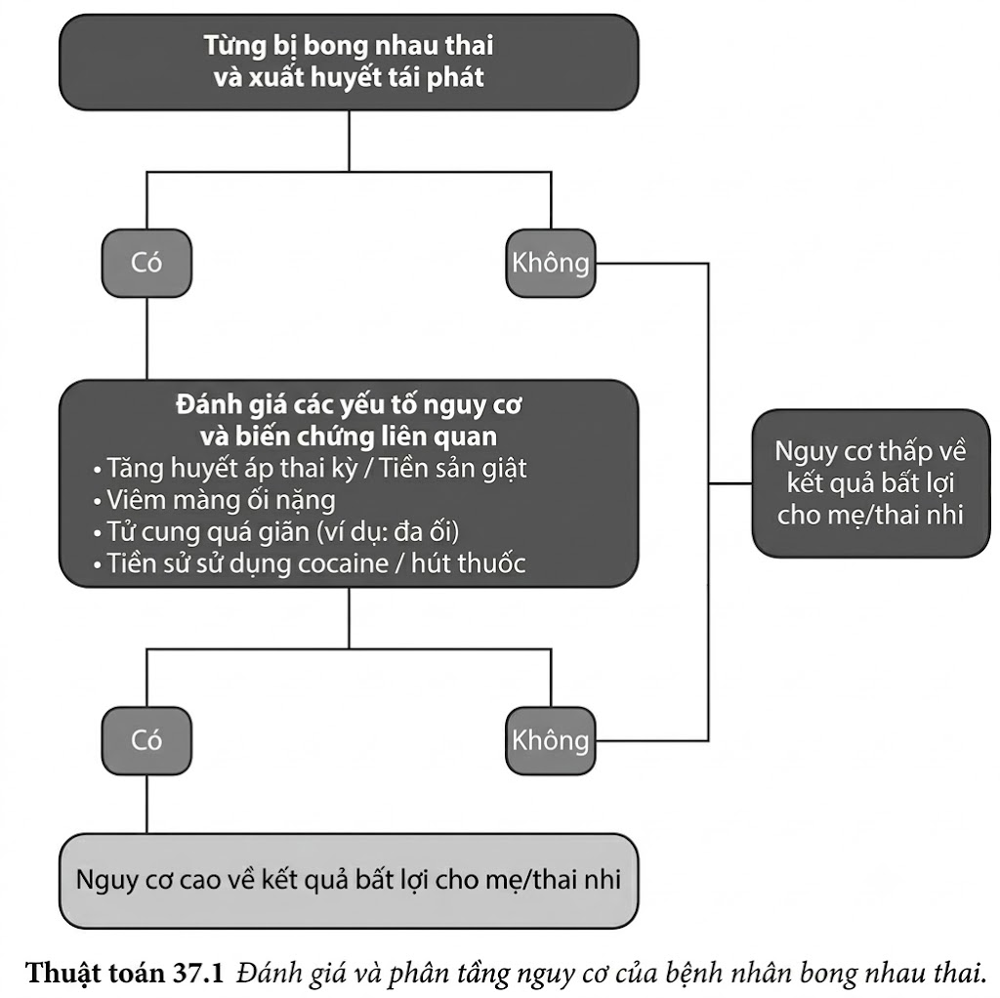
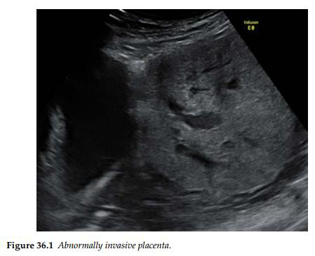

Bánh nhau xâm lấn bất thường (AIP) là một trong những biến chứng nghiêm trọng nhất của thai
kỳ, có liên quan đến tình trạng băng huyết sau sinh lớn, tỷ lệ mắc bệnh và tử vong cao ở người mẹ,
cùng với tần suất phải cắt bỏ tử cung sau sinh ở mức cao. Tình trạng bệnh lý này đôi khi còn được
gọi là nhau bám dính bệnh lý (morbidly adherent placenta). Việc lên kế hoạch sinh nở vào đúng
thời điểm, được thực hiện bởi đúng đội ngũ đa chuyên khoa phối hợp và tại đúng địa điểm phù
hợp có tiềm năng cải thiện đáng kể kết cục cho cả mẹ và con; và điều này chỉ có thể khả thi khi
AIP được nghi ngờ ngay từ giai đoạn trước sinh.

**Các yếu tố nguy cơ**

Các yếu tố nguy cơ có thể làm tăng khả năng mắc AIP nhưng không phải là điều kiện bắt buộc
để đưa ra chẩn đoán. Chúng bao gồm tuổi mẹ cao, thụ tinh nhân tạo (hỗ trợ sinh sản) và hút thuốc lá. Mối liên hệ
của các yếu tố nguy cơ này tương đối yếu và không cấu thành một cơ sở tốt để làm xét nghiệm
sàng lọc.

**Các điều kiện tiên quyết**

AIP có mối liên hệ trực tiếp với tiền sử mổ lấy thai trước đó — đặc biệt là các ca mổ chủ
động, khi đó vết sẹo mổ nhiều khả năng sẽ nằm ở đoạn dưới tử cung thay vì nằm ở đoạn cổ tử
cung như trong hầu hết các ca mổ lấy thai cấp cứu khi đã chuyển dạ.
Điều kiện tiên quyết thứ hai là sự làm tổ của túi thai ngay tại vị trí sẹo mổ hoặc khuyết sẹo
mổ lấy thai (ở giai đoạn đầu thai kỳ), sau đó tiến triển để hình thành nên tình trạng nhau tiền
đạo trong tam cá nguyệt thứ ba.

**Các dấu hiệu chỉ điểm trên siêu âm (Ultrasound markers)**

Bất kỳ thai phụ nào có tiền sử mổ lấy thai (hoặc từng phẫu thuật tử cung) và có nhau tiền đạo
trong thai kỳ này đều cần phải được đánh giá tình trạng AIP vào giai đoạn đầu của tam cá
nguyệt thứ ba. Các dấu hiệu siêu âm đáng tin cậy nhất của AIP bao gồm độ dày bánh nhau tăng lên và sự
xuất hiện của các xoang nhau (hồ huyết nhau - placental lacunae). Các đặc điểm khác như mất vùng kém âm bình thường sau nhau nằm giữa bánh nhau và tử
cung, hình ảnh bánh nhau lồi vào thành sau bàng quang, và sự gia tăng tín hiệu mạch máu trên
Doppler màu thường có tính nhất quán và độ tin cậy thấp hơn.

\*Tài liệu tham khảo\*\*

1. D’Antonio F, Iacovella C, Bhide A. Prenatal identification of invasive placentation using ultrasound: Systematic review and meta-analysis. _Ultrasound Obstet Gynecol_ 2013; 42: 509–17.
2. Jauniaux E, Bhide A. Prenatal ultrasound diagnosis and outcome of placenta previa accreta after cesarean delivery: A systematic review and meta-analysis. _Am J Obstet Gynecol_ 2017; 217: 27–36.
3. Jauniaux E, Bhide A, Kennedy A, Woodward P, Hubinont C, Collins S, for the FIGO Placenta Accreta Diagnosis and Management Expert Consensus Panel. FIGO consensus guidelines on placenta accreta spectrum disorders: Prenatal diagnosis and screening. _Int J Gynecol Obstet_ 2018; 140:274–80.

