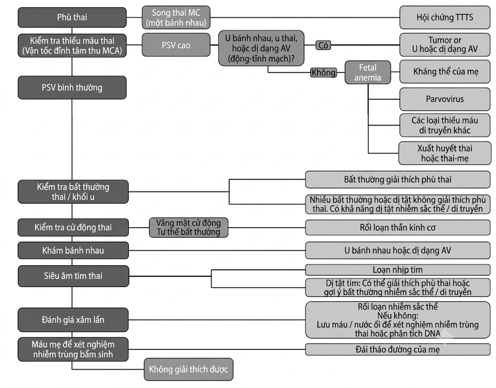
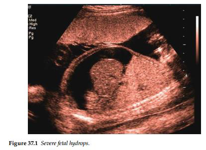
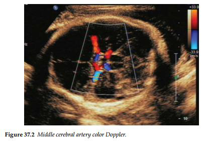

Phù thai được định nghĩa là tình trạng tích tụ dịch huyết thanh bất thường ở ít nhất hai khoang
chứa dịch của thai nhi — chẳng hạn như dịch ổ bụng, tràn dịch màng phổi, tràn dịch màng tim và
phù da. Đây là một phát hiện không đặc hiệu, xảy ra do nhiều bất thường tiềm ẩn khác nhau và có cơ chế
bệnh sinh từ sự mất cân bằng giữa quá trình sản xuất dịch với quá trình dẫn lưu bạch huyết trở về.
Tình trạng này có thể là hệ quả của suy tim, tắc nghẽn dòng chảy bạch huyết hoặc giảm áp lực
thẩm thuất keo của huyết tương. Đây là một bệnh lý hiếm gặp, xuất hiện với tỷ lệ khoảng 1 trên 2.000 trẻ sinh ra.

Phù thai có thể được chia thành hai nhóm, phù thai do miễn dịch: xảy ra do bệnh lý tán huyết ở thai nhi, hệ quả từ các kháng thể bất
thường kháng hồng cầu của người mẹ và phù thai không do miễn dịch: xảy ra do tất cả các nguyên nhân còn lại.
Mặc dù theo mô tả kinh điển, phù thai do miễn dịch — đặc biệt là bất đồng nhóm máu hệ
Rhesus (Rh) — từng là nguyên nhân phổ biến nhất, nhưng việc áp dụng liệu pháp dự phòng
bằng immunoglobulin cho những người mẹ có nguy cơ đã khiến cho các nguyên nhân không
do miễn dịch trở nên phổ biến hơn một cách tương đối.

Phù thai có tính chất không đặc hiệu và có thể do một số lượng lớn các rối loạn
tiềm ẩn, như:

- Thiếu máu thai nhi: Do đồng miễn dịch, nhiễm virus Parvovirus, xuất huyết và các thể
  thiếu máu di truyền.
- Dị tật cấu trúc thai nhi: Các dị tật tim, rối loạn nhịp tim và dị dạng thông động - tĩnh
  mạch (A-V).
- Chèn ép lồng ngực: Dị dạng nang tuyến phổi bẩm sinh (CCAM), phổi biệt lập, tắc nghẽn
  đường hô hấp trên.
- Bất thường nhiễm sắc thể hoặc các hội chứng di truyền ở thai nhi.
- Rối loạn chuyển hóa ở thai nhi: Các bệnh rối loạn dự trữ glycogen và lysosome.
- Nhiễm trùng bẩm sinh ở thai nhi: Nhiễm virus Cytomegalovirus (CMV), nhiễm
  Toxoplasma và virus Coxsackie.

## Quản lý

Điều này phụ thuộc hoàn toàn nguyên nhân tiềm ẩn. Tình trạng thiếu máu thai nhi do các
nguyên nhân miễn dịch có thể được điều trị bằng phương pháp truyền máu cho thai nhi mang
lại tỷ lệ sống sót và kết cục lâu dài rất xuất sắc nếu được điều trị phù hợp.
Thiếu máu thai nhi do nhiễm virus Parvovirus hoặc do xuất huyết thai nhi – mẹ cũng
thường có thể điều trị bằng liệu pháp truyền máu cho thai.
Các tình trạng rối loạn nhịp tim thai có thể được đảo ngược bằng các thuốc chống loạn nhịp,
giúp giải quyết tình trạng phù thai trong nhiều trường hợp.
Tình trạng phù thai do chèn ép bởi tràn dịch màng phổi cũng đã được báo cáo là có cải
thiện sau khi tiến hành thủ thuật đặt ống thông dẫn lưu khoang màng phổi - buồng ối.

## Tài liệu tham khảo

1. Gajjar K, Spencer C. Diagnosis and management of non-anti-D red cell antibodies in pregnancy. _Obstet Gynaecol_. 2009; 11: 89–95.
2. Santo S, Mansour S, Thilaganathan B et al. Prenatal diagnosis of non-immune hydrops fetalis: What do we tell the parents? _Prenat Diagn_. 2011 Feb; 31(2): 186–95.

