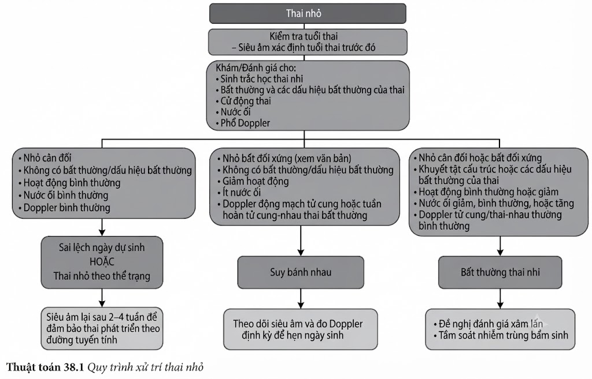
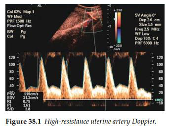
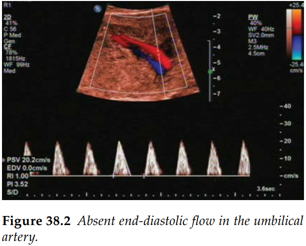
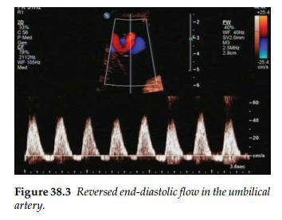
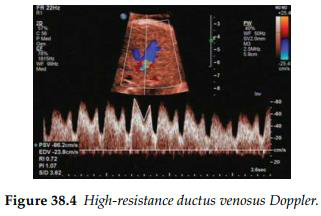
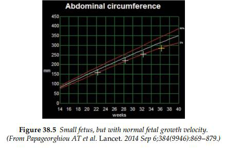
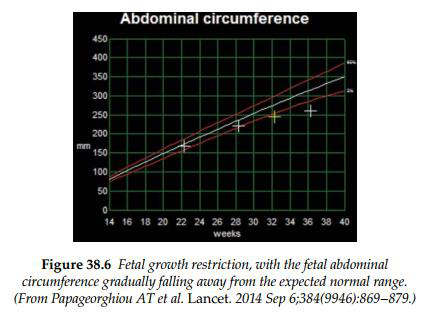

Thai nhỏ so với tuổi thai (SGA) thường được định nghĩa phổ biến nhất là kích thước thai
nhi dưới bách phân vị thứ 10 so với tuổi thai. Nhóm em bé này nhìn chung bao gồm những thai
nhi nhỏ do thể tạng (nhỏ tự nhiên nhưng bình thường) hoặc những thai nhi không đạt được tiềm
năng tăng trưởng sinh học vốn có của mình — tức là thai chậm tăng trưởng trong tử cung (FGR).

## Chẩn đoán

### Thai nhỏ so với tuổi thai (SGA)

Các chỉ số đo đạc thai nhi, thông thường là chu vi vòng bụng (AC), nằm dưới bách phân
vị thứ 10 so với tuổi thai.

### Thai chậm tăng trưởng trong tử cung (FGR)

FGR đã được định nghĩa thông qua một quy trình đồng thuận quốc tế, bao gồm kích thước
thai và dòng chảy mạch máu (Doppler):

FGR khởi phát sớm

Chẩn đoán dựa trên sự xuất hiện của một trong ba tiêu chí độc
lập (chu vi vòng bụng [AC] dưới bách phân vị thứ 3, hoặc ước tính trọng lượng thai [EFW] &lt; bách phân vị thứ 3, hoặc mất dòng tâm trương ở động mạch rốn [UA])
HOẶC chỉ số AC hoặc EFW dưới bách phân vị thứ 10 kết hợp với chỉ số mạch (PI) &gt; bách
phân vị thứ 95 ở động mạch rốn hoặc động mạch tử cung.

FGR khởi phát muộn

Chu vi vòng bụng (AC) dưới bách phân vị thứ 3, HOẶC ước tính trọng lượng thai (EFW) dưới bách phân vị thứ 3, HOẶC có ít nhất hai trong ba tiêu chí sau đây:

- AC dưới bách phân vị thứ 10, HOẶC EFW dưới bách phân vị thứ 10.
- AC hoặc EFW sụt giảm &gt; 2 tứ phân vị.
- Tỷ lệ não - nhau (CPR) dưới bách phân vị thứ 5, HOẶC chỉ số
  mạch (PI) của động mạch rốn cao hơn bách phân vị thứ 95.

## Nguyên nhân

Nói một cách rộng rãi, có 4 lý do khiến kích thước thai nhi bị nhỏ:

- Tính sai tuổi thai.
- Thai nhỏ do thể tạng (nhỏ sinh lý bình thường).
- Chức năng bánh nhau kém.
- Một số bất thường di truyền hoặc cấu trúc của thai nhi.

### Tính sai tuổi thai

- Hãy tính tuổi thai dựa trên một kết quả siêu âm chất lượng tốt ở giai đoạn sớm trước đó.
  Các kết quả siêu âm càng sớm càng có độ tin cậy cao, đặc biệt là khi phép đo chiều dài đầu
  mông (CRL) được thực hiện trong khoảng từ 9 đến 14 tuần. _Một khi bạn đã xác định được tuổi thai từ mốc siêu âm sớm đáng tin cậy này, không được thay đổi tuổi thai ở các lần siêu âm muộn hơn — điều này sẽ làm tăng nguy cơ bỏ sót các bất thường tăng trưởng quan trọng._
- Trong các trường hợp thai phụ đến khám muộn hoặc có nghi ngờ về tuổi thai, cần tiến hành
  một cuộc siêu âm lại sau 3–4 tuần để đảm bảo thai nhi vẫn tiếp tục tăng trưởng trên cùng
  một đường bách phân vị. Nếu có sự sụt giảm tăng trưởng sâu hơn, cần cân nhắc đến một
  chẩn đoán thay thế.

### Nhỏ do thể tạng

- Các chỉ số Doppler động mạch tử cung, lượng nước ối và các chỉ số
  Doppler thai nhi hoàn toàn bình thường.

### Suy bánh nhau

- Tình trạng FGR có tính chất không cân đối.
  - Thông thường, chu vi vòng bụng (AC) sẽ bị ảnh hưởng nhiều hơn chiều dài xương đùi (FL) và sau cùng là chu vi vòng đầu (HC).
  - Trong các trường hợp chậm tăng trưởng khởi phát sớm mức độ nghiêm trọng, chiều dài xương đùi có thể là chỉ số bị ảnh hưởng đầu tiên.
- Các khảo sát Doppler cho kết quả bất thường, với trình tự biến đổi sóng Doppler
  điển hình xuất hiện trước tiên ở động mạch tử cung, sau đó đến động mạch
  rốn, và tiếp theo là động mạch não giữa. Chuỗi bất thường này sau đó sẽ lan đến
  hệ tĩnh mạch thai nhi tại ống tĩnh mạch và cuối cùng là tĩnh mạch rốn; đồng thời
  việc theo dõi nhịp tim thai trước sinh (CTG) sẽ ghi nhận chỉ số dao động nội tại
  ngắn hạn (STV) bị sụt giảm. - Động mạch tử cung: Trở kháng dòng chảy cao (chỉ số PI hoặc RI cao, notches hai bên). - Động mạch rốn: Trở kháng dòng chảy cao (PI hoặc RI cao), có thể biểu hiện tình trạng mất hoặc đảo ngược dòng vận tốc cuối tâm trương. - Động mạch não giữa: Trở kháng dòng chảy thấp (PI hoặc RI thấp) do cơ chế bảo vệ não. - Ống tĩnh mạch: Trở kháng dòng chảy cao (PIV cao), có thể biểu hiện tình trạng mất hoặc đảo ngược sóng a (a-wave).

### Bất thường ở thai nhi

- Sự xuất hiện của tình trạng FGR đồng thời với các dị tật cấu trúc thai nhi, các dấu hiệu chỉ điểm của khiếm khuyết nhiễm sắc thể, hoặc tình trạng đa ối cho thấy có sự diện diện của một bất thường thai nhi bẩm sinh hoặc mắc phải.
- Các nguyên nhân bao gồm:
  - Bất thường nhiễm sắc thể, thường gặp nhất là bộ nhiễm sắc thể tam bội, trisomy 18 hoặc 13.
  - Nhiễm trùng thai nhi bẩm sinh, ví dụ Rubella, CMV, Toxoplasmosis.
  - Hội chứng nhiễm rượu bào thai.
  - Một số bất thường di truyền hiếm gặp, ví dụ uniparental disomy – lệch bội đơn nguồn gốc, hội chứng Silver–Russell.

## Tài liệu tham khảo

1. Crino JP, Driggers RW. Ultrasound Findings Associated with Antepartum Viral Infection. _Clin Obstet Gynecol_. 2018 Mar; 61(1): 106–21.
2. Papageorghiou AT et al. International standards for fetal growth based on serial ultrasound measurements: the Fetal Growth Longitudinal Study of the INTERGROWTH-21st Project. _Lancet_. 2014 Sep 6; 384(9946): 869–879.

