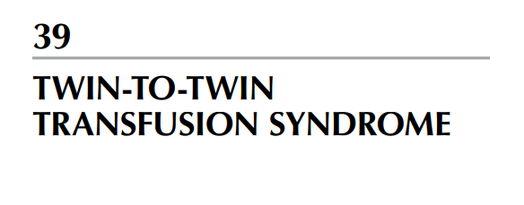
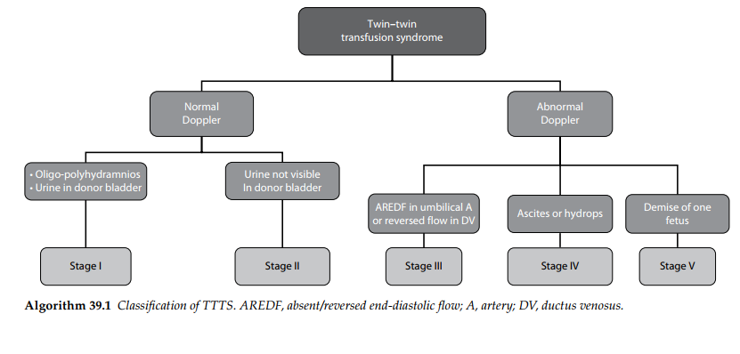

Khoảng 22% các thai kỳ song thai là song thai một bánh nhau (MC) và có khoảng 10%–15% số

ca song thai một bánh nhau bị biến chứng bởi hội chứng truyền máu song thai (TTTS) mức độ

nghiêm trọng, hệ quả từ tình trạng mất cân bằng tuần hoàn mạn ở các vòng nối mạch máu liên kết

giữa hai thai nhi.

Hội chứng TTTS mạn tính thường khởi phát vào giai đoạn giữa của tam cá nguyệt thứ hai

với một loạt các dấu hiệu ở cả người mẹ và chu sinh. TTTS mạn tính mang tính chất tiến triển liên

tục và có liên quan đến tỷ lệ cao tử vong thai nhi nếu không được điều trị. Hội chứng TTTS cấp

tính thường xảy ra trong tam cá nguyệt thứ 3 và biểu hiện dưới dạng chuỗi triệu chứng đa ối/thiểu

ối. Thể cấp tính này thường không mang tính tiến triển và điển hình là không cần phải tiến hành

can thiệp điều trị.

- Dự báo hội chứng TTTS

Mặc dù tình trạng tăng khoảng sáng sau gáy (NT) từng được báo cáo là một dấu hiệu chỉ điểm

cho sự phát triển của hội chứng TTTS về sau, nhưng điều này đã không được chứng minh rõ

ràng trong các nghiên cứu với cỡ mẫu lớn hơn. Tuy nhiên, hiện tượng nếp màng ối giữa hai

thai có thể được nhận diện từ tuần thứ 15–17 của thai kỳ; đây là biểu hiện sớm của sự chênh

lệch thể tích nước ối và có liên quan đến sự tiến triển thành TTTS mức độ nặng trong khoảng

25% các trường hợp.

- Chẩn đoán hội chứng TTTS

Hội chứng TTTS mạn tính được chẩn đoán trước sinh dựa trên việc nhận diện thai cho có biểu

hiện thiểu ối hoặc vô ối, đồng thời thai nhận xuất hiện tình trạng đa ối.

- Thai cho: Trông giống như bị "bó chặt", có ước tính trọng lượng thai nhỏ hơn và bàng

quang xẹp hoặc rất nhỏ không quan sát thấy.

- Thai nhận: Thường có cân nặng ở mức trung bình hoặc trên mức trung bình đi kèm

với một bàng quang lớn.

Các biến đổi trên phổ Doppler có thể đi kèm với những phát hiện này và thường là dấu

hiệu cho thấy tình trạng TTTS đang trở nên tồi tệ hơn. Thai cho có thể bị mất hoặc đảo

ngược sóng cuối tâm trương khi khảo sát Doppler động mạch rốn. Các đặc điểm bổ sung

bao gồm tình trạng phì đại cơ tim với khả năng co bóp kém ở thai nhận máu. Khi hội chứng

TTTS diễn tiến nặng hơn nữa, thai nhận máu có thể xuất hiện tình trạng phù thai.

- Phân độ hội chứng TTTS

Đã có nhiều nỗ lực được thực hiện nhằm phân độ tiến trình bệnh lý trong hội chứng

TTTS; tuy nhiên, mối tương quan giữa hệ thống phân độ này với tiến trình tự nhiên và

kết cục lâm sàng của TTTS vẫn cần phải được thiết lập và nghiên cứu thêm.

- Quản lý hội chứng TTTS

- Phương pháp phẫu thuật quang đông bằng tia laser bao gồm việc luồn một sợi sơ

laser thông qua ống nội soi thai nhi đi vào trong buồng ối của thai nhận máu dưới sự

hướng dẫn của siêu âm. Các cầu nối mạch máu giữa hai thai sẽ bị quang đông bằng tia

laser ngay trên bề mặt bánh nhau, và lượng nước ối dư thừa sẽ được dẫn lưu vào cuối

thủ thuật.

Biện pháp phẫu thuật nội soi đốt laser các cầu nối mạch máu hiện nay mang lại tỷ lệ

sống sót từ 66%–82% cho ít nhất một trong hai thai. Các di chứng thần kinh bất lợi sau

sinh đã được báo cáo xuất hiện ở khoảng 5% số trẻ sống sót.

Dịch sơ đồ:

HỘI CHỨNG TRUYỀN MÁU SONG THAI (Twin-twin transfusion

syndrome)

NHÁNH 1 (BÊN TRÁI): Doppler bình thường

- Thiểu ối - Đa ối & Có nước tiểu trong bàng quang thai:

 Giai đoạn I (Stage I).

- Không quan sát thấy nước tiểu trong bàng quang thai cho

 Giai đoạn II (Stage II).

NHÁNH 2 (BÊN PHẢI): Doppler bất thường

- Có dấu hiệu AREDF ở động mạch rốn HOẶC đảo ngược dòng chảy ở ống tĩnh mạch

 Giai đoạn III (Stage III).

- Có dịch ổ bụng hoặc phù thai ở một trong hai thai

 Giai đoạn IV (Stage IV).

- Một thai bị tử vong/ thai lưu

 Giai đoạn V (Stage V).

Dịch chú thích chữ viết tắt dưới chân hình (Caption):

Sơ đồ 39.1: Phân loại hội chứng TTTS (Bảng phân độ Quintero).

- AREDF: Tình trạng mất hoặc đảo ngược sóng cuối tâm trương.

- A (Artery): Động mạch.

- DV (Ductus venosus): Ống tĩnh mạch.

